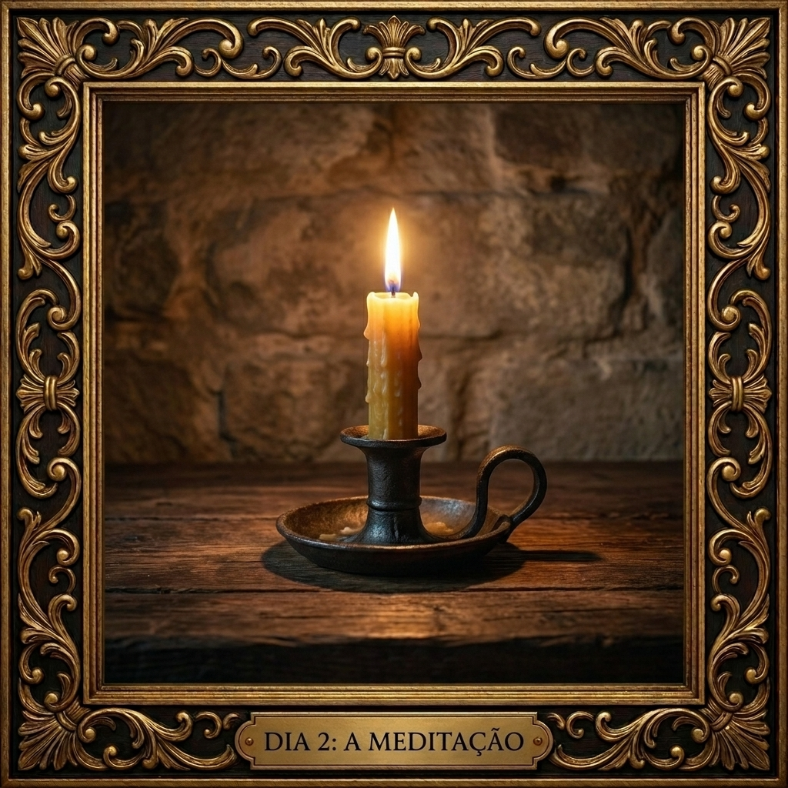
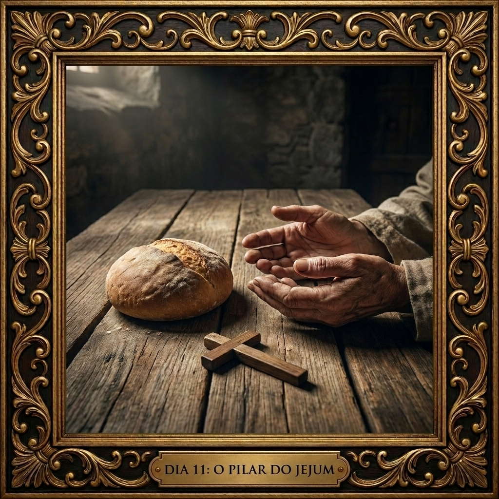
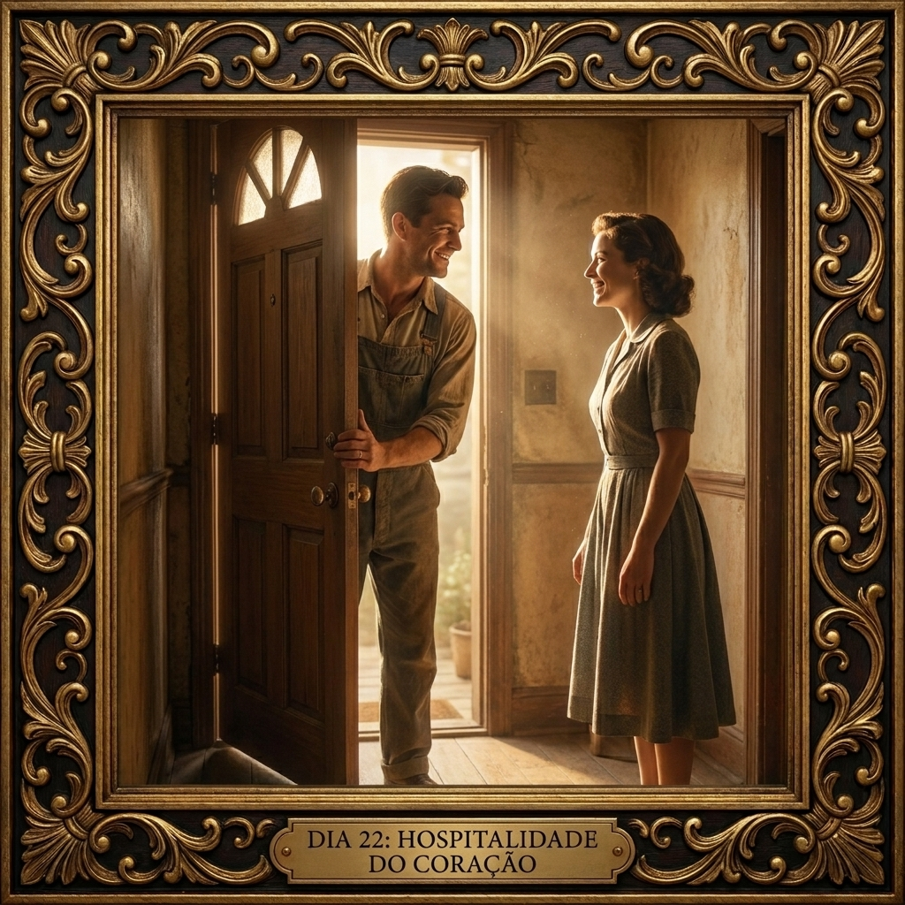

## **A Mãe Forte — Um Itinerário de 33 Dias**

**Você está tentando decorar uma casa que ainda não tem alicerce?**

Muitas mães hoje vivem sob o peso da exaustão crônica, da irritabilidade e de uma culpa que parece não ter fim. Buscam desesperadamente pela paciência ou pela doçura, mas esquecem que nenhuma dessas virtudes para de pé sem a base que sustenta o lar: a **Fortaleza**.

Em **"A Mãe Forte"**, a psicóloga e consultora familiar Carolina Cordaro Pereira propõe um caminho de reconstrução interior de 33 dias. Este não é um livro de dicas rápidas, mas um guia profundo para mães que desejam transformar o "altar da rotina" em um caminho real de santificação e equilíbrio emocional.

### **Os Diferenciais da Jornada:**

1) Fé e Razão (O Encontro da Verdade)

O itinerário une a sabedoria milenar de Doutores da Igreja, como Santo Tomás de Aquino, aos mais recentes estudos da neurociência e psicologia moderna, utilizando ferramentas como a Terapia Comportamental Dialética (DBT).

2) Ciclo da Plenitude (33 Dias): Neurociência e a Vida de Cristo

O encontro perfeito entre a **neuroplasticidade** e a **teologia**. Trinta e três dias é o tempo biológico para que o cérebro consolide novos hábitos nos gânglios basais e, simbolicamente, é o tempo necessário para que a Divindade se manifestasse plenamente na humanidade através dos 33 anos terrestres de Jesus.

3) Tripé Milenar da Igreja

A jornada é construída sobre o fundamento dado por Cristo no Evangelho: **Oração, Jejum e Esmola**. Entenda como essas práticas são as ferramentas perfeitas para o abastecimento da alma, a educação da vontade e o transbordamento da caridade.

4) Teoria e Prática

Você não ficará apenas na teoria; cada capítulo encerra com uma **Lista de Exercícios Práticos**. O objetivo é encarnar a virtude na rotina de quem dobra roupas, limpa o leite derramado e educa almas para o Céu.

5) Feito para a Mãe Real

Com estimativas de leitura de aproximadamente **8 minutos por dia**, o conteúdo respeita a carga cognitiva de uma mãe sobrecarregada, sendo ideal para o seu momento de oração matinal ou café da manhã.

6) Exemplos reais de mães santas por capítulo

Cada pilar é fundamentado na vida de uma mãe que nos precedeu no caminho da perfeição. Através de exemplos reais como **Santa Zélia Martin**, **Santa Gianna Molla** e **da própria Virgem Maria**, você verá que a virtude não é uma abstração, mas algo vivido no "caos santo" da vida real.

7) Da Sobrevivência ao Governo

Aprenda o sentido profundo da ***Hypomoné*** — a capacidade de suportar o peso da sua vocação sem se deixar quebrar pelo vitimismo, assumindo o governo do seu lar com os olhos fixos na eternidade.

### SUMÁRIO (33 DIAS)

**PARTE I: A FUNDAÇÃO (A Alma da Mãe)**

* **Dia 1:** O que é a Fortaleza?   
* **Dia 2:** A Meditação  

  

  

**PARTE II: O PILAR DA ORAÇÃO (A Escola do Combate)**

* **Dia 3:** **Introdução ao Pilar da Oração e Meditação de Preparo** (Selando a Vontade).  
* **Dia 4:** Devoção — O motor da oração (a vontade de rezar, mesmo sem sentir nada).  
* **Dia 5:** Adoração — O corpo na oração (como a postura física reflete e ajuda a vontade).  
* **Dia 6:** Recolhimento — A preparação (o silenciar dos estímulos externos e a "cela interior").  
* **Dia 7:** Atenção — O foco (como lidar com as distrações internas e o Efeito Zeigarnik).  
* **Dia 8:** Louvor por Fórmulas — O descanso da mente (orações prontas para dias de exaustão).  
* **Dia 9:** Louvor pelo Canto — A regulação emocional (usar a voz e a melodia para elevar a alma).  
* **Dia 10:** Petição e Intercessão — O ápice da caridade (clamando o Céu pelos filhos).

*A mãe prepara a vontade, ajeita o corpo, silencia o ambiente, foca a mente, usa a voz e, finalmente, derrama a sua oração sobre os seus filhos.*

  

**PARTE III: O PILAR DO JEJUM (A Educação da Vontade e dos Sentidos)**

* **Dia 11:** **Introdução ao Pilar do Jejum e Meditação de Preparo** (Selando a Temperança).  
* **Dia 12:** Abstinência de Conforto — A Tolerância ao Desconforto (a "Pequena Via" física).  
* **Dia 13:** Abstinência de Descanso — O "Minuto Heróico" (vencendo a inércia e a preguiça).  
* **Dia 14:** Abstinência de Alimentos — A quebra da "gula emocional" (o fim do doce como anestésico).  
* **Dia 15:** O Jejum Estrito — A purificação da biologia (adaptada à prudência materna).  
* **Dia 16:** A Vigília — O sacrifício do sono (santificando as madrugadas e o tempo).  
* **Dia 17:** O Silêncio — O freio das paixões (renúncia a murmurações, telas e ruídos).  
* **Dia 18:** O Retiro — O desapego do mundo (criando a "cela interior" no meio da casa).

*A mãe doma o conforto do corpo, vence a letargia, educa o paladar, santifica a madrugada, freia a própria língua e, por fim, isola a alma das distrações do mundo.*

  

**PARTE IV: O PILAR DA ESMOLA (A Transbordância da Caridade)**

* **Dia 19:** **Introdução ao Pilar da Esmola e Meditação de Preparo** (Selando a Misericórdia).

**A Misericórdia na Matéria (Obras Corporais):**

* **Dia 20:** Dar de comer e beber — A nutrição do corpo e o combate à escassez física.  
* **Dia 21:** Vestir os nus — A dignidade da roupa, a ordem do lar e a esmola do desapego.  
* **Dia 22:** Dar pousada aos peregrinos — A hospitalidade e a criação de um lar que acolhe.  
* **Dia 23:** Visitar os enfermos — O cuidado com a saúde física da família e dos amigos.  
* **Dia 24:** Visitar os presos — O socorro aos que estão "presos" na solidão ou no puerpério.  
* **Dia 25:** Remir os cativos — O sacrifício de si para libertar o outro de fardos.  
* **Dia 26:** Sepultar os mortos — A honra ao corpo e o "enterrar" do homem velho.

**A Misericórdia no Espírito (Obras Espirituais):**

* **Dia 27:** Dar bom conselho — A prudência materna na orientação do coração.  
* **Dia 28:** Ensinar os ignorantes — A esmola da instrução e a formação das virtudes.  
* **Dia 29:** Corrigir os que erram — A caridade da disciplina e da autoridade firme.  
* **Dia 30:** Consolar os aflitos — O acolhimento emocional e o bálsamo da esperança.  
* **Dia 31:** Perdoar as ofensas — A purificação do convívio e a restauração da paz.  
* **Dia 32:** Suportar com paciência as falhas — O heroísmo de conviver com a imperfeição.  
* **Dia 33:** Rezar pelos vivos e mortos — O ápice da esmola: a intercessão eterna.

*A mãe doa o esforço do seu corpo, entrega o seu tempo livre, instrui o intelecto, corrige a vontade, suporta o caos com paciência, perdoa com amor e, finalmente, abre a porta da sua família para o mundo.*

  

## **Por que 33 Dias?**

**Estimativa de tempo de leitura:** 3 minutos.

Uma dúvida comum pode surgir ao segurar este livro: *"Por que um itinerário de trinta e três dias? É tempo suficiente para mudar uma vida exausta?"* Como psicóloga e mãe, garanto que este número não é uma escolha aleatória; ele é o ponto de encontro perfeito entre o **limiar da neuroplasticidade**, a **pedagogia dos santos** e a **plenitude da vida cristã**.

### **1\. O Alicerce Biológico: A Janela da Mudança**

A ciência moderna desmistificou a ideia de que mudamos hábitos em apenas vinte e um dias. Estudos da University College London (UCL) indicam que a estabilização de novas respostas mentais ocorre, de forma consistente, a partir de **trinta dias** de prática deliberada¹.

Neurologicamente, este é o período de "migração de comando". No início, o seu **Córtex Pré-Frontal** (a área do esforço e da decisão consciente) fica sobrecarregado — o que explica por que a primeira semana de oração ou jejum parece esgotante. Contudo, por volta da quarta semana, as conexões neurais começam a se consolidar nos **Gânglios Basais**, a sede dos hábitos automatizados. É quando a virtude deixa de ser um "esforço hercúleo" para começar a se tornar parte da sua identidade².

### **2\. O Alicerce Teológico: O Número da Plenitude**

Na tradição cristã, o número **33** reveste-se de um simbolismo altíssimo: representa a idade terrestre de Nosso Senhor Jesus Cristo. Trinta e três anos foi o tempo necessário para que a Divindade se manifestasse plenamente na humanidade, passando pelo silêncio de Nazaré e pelo sacrifício do Calvário.

Ao propormos trinta e três dias, convidamos você a dedicar um dia para cada ano da vida de Cristo. É um tempo de maturação que nos prepara para os grandes ciclos bíblicos de **quarenta dias** (a Quaresma, o tempo de Moisés no Sinai ou de Jesus no deserto)³. Se o "quarenta" é o tempo da plenitude de Deus, o "trinta e três" é o tempo da nossa caminhada humana em direção a Ele. É o treinamento intensivo para que a alma suporte os desertos da vida sem se quebrar.

### **3\. A Herança Inaciana: Um Mês para Reformar a Vida**

A maior escola de transformação espiritual da história, os *Exercícios Espirituais* de Santo Inácio de Loyola, é estruturada exatamente em \*\*quatro semanas (trinta dias)\*\*⁴. Inácio compreendeu que um mês é o tempo humano ideal para percorrer as vias da purificação e da iluminação. Adicionamos a esta herança **três dias de "digestão" espiritual** — um após cada grande pilar (Oração, Jejum e Esmola).

Como psicóloga, reconheço que a sua **carga cognitiva** como mãe está no limite. Por isso, este itinerário não é uma corrida de obstáculos. Os dias de transição servem para que você não apenas leia, mas "rumine" e medite sobre o que aprendeu, garantindo que o conhecimento não seja apenas informação passiva, mas uma ferramenta ativa de mudança de comportamento.

### **A Estrutura da Jornada**

Este itinerário de 33 dias foi organizado para respeitar o seu ritmo biológico e a sua sede de eternidade:

* **Fundação (Dias 1-2):** Onde ajustamos o seu *locus de controle*.  
* **Pilar da Oração (Dias 3-10):** O abastecimento (Incluindo 1 dia de meditação de preparo).  
* **Pilar do Jejum (Dias 11-18):** O esvaziamento (Incluindo 1 dia de meditação de preparo).  
* **Pilar da Esmola (Dias 19-33):** O transbordamento em 14 obras (Incluindo 1 dia de meditação de preparo).

Trinta e três dias é o tempo necessário para que o seu sistema nervoso "resete" os picos de cortisol e comece a operar sob a força da Fortaleza. Se você for fiel a este mês, o que hoje parece um sacrifício insuportável amanhã será a rocha que sustenta o seu lar.

  

#### **Referências Técnicas e Bibliográficas:**

¹ **Lally, P., et al. (2009).** *How are habits formed: Modelling habit formation in the real world.* European Journal of Social Psychology. ² **Graybiel, A. M. (2008).** *Habits, Rituals, and the Evaluative Brain.* Annual Review of Neuroscience. ³ **Catecismo da Igreja Católica (CIC), §540.** (Sobre o simbolismo do tempo de Jesus no deserto). ⁴ **Loyola, I. (1548).** *Exercícios Espirituais.* (A estrutura de quatro semanas para a reforma de vida). ⁵ **Draganski, B., et al. (2004).** *Neuroplasticity: Changes in grey matter induced by training.* Nature.

  

**PARTE I: A FUNDAÇÃO** 

<h3 align="center">***DIA 1: O que é a fortaleza? Por que querer ser forte?***</h3>

***Estimativa de tempo de leitura:** 7 a 8 minutos.*

Muitas mães hoje vivem sob o peso da exaustão, da irritabilidade e de uma culpa que parece não ter fim. Sentimo-nos frágeis diante da missão de educar almas para o Céu. Quando o cansaço atinge o corpo e a mente, a força de que precisamos para continuar não é muscular; é uma fortaleza que envolve a regulação da nossa psique, mas que só encontra a sua plenitude no auxílio espiritual.

Para São Tomás de Aquino, a fortaleza é uma arquitetura da alma que se manifesta em três níveis complementares. Compreender esta estrutura ajuda-nos a ver onde a nossa natureza humana termina e onde a Graça de Deus precisa entrar:

#### **1\. A Virtude Cardeal (A Base Humana)**

A fortaleza é, antes de tudo, a virtude humana que firma a mente contra os perigos e suporta as dificuldades (ST II-II, q.123, a.1). Sem ela, a mãe torna-se escrava das circunstâncias: se as crianças dormem bem, ela está em paz; se elas choram, ela desmorona.

A psicologia valida esta fragilidade. Quando o nosso estado interior é ditado apenas pelo ambiente, operamos com o que se chama de **Locus de Controle Externo**. Treinar a virtude humana da fortaleza ajuda a desenvolver um **Locus de Controle Interno**, permitindo à mãe manter a estabilidade emocional independentemente do caos na sala de estar.

Esta virtude cardeal manifesta-se de duas formas:

* **Agir:** É a força para corrigir um filho, para estabelecer ordem na casa e para tomar a iniciativa do bem.  
* **Sustentar/Suportar:** Este é o ato principal da Fortaleza (ST II-II, q.123, a.6). Santo Tomás ensina que é muito mais difícil sustentar do que atacar. Sustentar significa permanecer firme sob o peso de uma dificuldade prolongada, como o cansaço crônico materno. Na terapia comportamental, treina-se a **Tolerância ao Sofrimento** (Distress Tolerance), a capacidade de suportar uma crise sem agir de forma destrutiva. A virtude natural da fortaleza age de forma semelhante: educa a nossa vontade para não fugir da dor do dever.

#### **2\. A Virtude Infusa (A Elevação Sobrenatural)**

Se dependêssemos apenas da psicologia e do nosso esforço natural, o cansaço materno acabaria por nos vencer. É aqui que entra o mistério da Graça. Recebemos no Batismo a Fortaleza Infusa (ST I-II, q.63, a.3). Esta não é uma mera técnica de regulação emocional; é uma força divina derramada na alma. Ela eleva a nossa capacidade natural, permitindo que a mãe suporte o peso da rotina não apenas por um "dever" moral exaustivo, mas movida por um amor autêntico a Deus e focada na santidade.

#### **3\. O Dom do Espírito Santo**

Por fim, o Dom da Fortaleza é uma disposição puramente espiritual pela qual a alma se torna dócil à inspiração direta do Espírito Santo. Ele permite-nos superar obstáculos que humanamente seriam intransponíveis (ST II-II, q.139, a.1). É este dom que nos sustenta quando a nossa biologia e a nossa força de vontade já se esgotaram completamente.

#### **O Sentido da Hypomoné e o Auxílio Divino**

Nesse contexto, podemos compreender o sentido profundo da hypomoné. No grego bíblico, este termo descreve uma perseverança heróica; é o "permanecer sob" o peso da nossa vocação sem se deixar quebrar. Não é uma espera passiva, mas a aceitação ativa da cruz cotidiana.

A ciência estuda a perseverança humana sob o conceito de **Grit** (Garra), definindo-a como a capacidade de manter o esforço focado em objetivos a longo prazo. O Grit é excelente para alcançar sucesso numa dieta ou num projeto de trabalho. Contudo, a hypomoné não é apenas a versão cristã da "garra psicológica". Enquanto o Grit se apoia no esforço próprio (Locus Interno), a hypomoné é a virtude humana elevada pela Graça: você persevera suportando a dificuldade, sabendo que aquele peso a purifica, e contando, a cada minuto, com o ombro de Cristo a sustentar a cruz consigo.

Nossa Senhora encaixa-se aqui como a Mãe Forte por excelência. A sua fortaleza não foi demonstrada em campos de batalha bélicos, mas no silêncio da sustentação. Ela é a Stabat Mater: aquela que permaneceu de pé, amparada pela força do Alto, oferecendo a sua dor junto à Cruz.

Se no Evangelho vemos que João Batista e o próprio Jesus passaram por um processo de amadurecimento natural e espiritual (Lc 1, 80 e Lc 2, 52), é porque o fortalecimento da psique e do espírito é o pré-requisito para qualquer missão heróica.

A sua maternidade não é uma tarefa doméstica comum; é a sua missão. Assim como os profetas precisaram crescer em espírito para salvar o povo, você precisa fortalecer-se agora para guiar as almas que lhe foram confiadas. Ser uma mãe forte é entender que cada filho é um projeto de Deus que depende da sua capacidade de sustentar, com amor firme e total dependência da Graça, a estrutura da sua família.

#### **Lista de Exercícios**

- [ ] **Tomada de Consciência:** Santo Tomás diz que a fortaleza busca um "bem árduo". Qual é o bem árduo que você busca hoje? (Ex: a paz da minha casa, a virtude do meu filho). Foque no valor do bem, e não no desconforto da dificuldade presente.  
- [ ] **Tomada de Decisão:** Comprometa-se a realizar o exercício proposto a cada dia deste livro. Entenda que, como num treino, haverá dias de resistência, mas é a repetição perseverante que abre o caminho para a ação de Deus na nossa alma.  
- [ ] **A Oração de Entrega:** Peça, de forma simples e direta, o **Dom da Fortaleza**. Peça que o Espírito Santo aja onde a sua natureza, os seus hormônios e a sua psicologia falham.

***Jaculatória para Guardar:** "Senhor, não peço que tires o peso, mas que fortaleças os meus ombros com a Tua Graça."*

  

#### ***Referências e Notas Explicativas:***

* ***Bíblia Sagrada:***  
  * ***Lc 1, 80:** Refere-se ao crescimento espiritual de São João Batista antes de sua missão no deserto.*  
  * ***Lc 2, 52:** Descreve o amadurecimento de Jesus em sabedoria, estatura e graça.*  
* ***Santo Tomás de Aquino (Suma Teológica):***  
  * ***ST II-II, q.123, a.1:** Define a fortaleza como a virtude que dá firmeza à alma contra o medo.*  
  * ***ST II-II, q.123, a.6:** Explica por que "sustentar" (suportar o difícil) é um ato mais heróico e principal da fortaleza do que o "atacar".*  
  * ***ST I-II, q.63, a.3:** Trata das virtudes infusas.*  
  * ***ST II-II, q.139, a.1:** Define o Dom da Fortaleza.*  
* ***Ciência e Psicologia:***  
  * ***Rotter, J. B. (1966):** Generalized expectancies for internal versus external control of reinforcement. Estudo clássico sobre Locus de Controle Interno vs. Externo.*  
  * ***Duckworth, A. L., et al. (2007):** Grit: Perseverance and passion for long-term goals. (Journal of Personality and Social Psychology). Estuda a perseverança perante adversidades, aqui contrastada com o conceito sobrenatural da hypomoné.*  
  * ***Linehan, M. M. (1993):** Cognitive-Behavioral Treatment of Borderline Personality Disorder. Obra base para a Tolerância ao Sofrimento (Distress Tolerance).*

  

<h3 align="center">***DIA 2: A Meditação e o Sentido da Hypomoné***</h3>

*Estimativa de tempo de leitura: 6 a 7 minutos.*

No primeiro dia, compreendemos que a Fortaleza é um eixo da nossa alma e que o seu ato principal é o sustinere: a capacidade de suportar o peso da nossa vocação. Vimos a importância da hypomoné — aquela perseverança em nível heróico que, amparada pela Graça, nos permite "permanecer sob" a cruz de cada dia, olhando para o Céu.

Todavia, essa resistência corre um risco grave: tornar-se um estoicismo seco, frio e amargo. Sem a meditação, a mãe que tenta ser forte apenas pela força de vontade acaba por se tornar endurecida e ressentida. Se você apenas "suporta" o peso sem contemplar o sentido dele, o sacrifício torna-se um fardo estéril que esmaga a sua psique.

#### **A Psicologia do Sentido e o "Piloto Automático"**

A psiquiatria moderna, especialmente através da Logoterapia fundada pelo Dr. Viktor Frankl (que sobreviveu a campos de concentração), comprovou que o ser humano não é destruído pelo sofrimento em si, mas pelo sofrimento sem sentido. Frankl costumava citar que "quem tem um 'porquê' para viver pode suportar quase qualquer 'como'".

Quando a mãe opera no "piloto automático", a sua mente entra num estado de esgotamento e alienação. É a meditação cristã que responde a esse abismo psicológico, dando-nos o "porquê". Sem a meditação, corremos o risco de repetir frases como "quero que os meus filhos sejam santos" de forma mecânica, transformando verdades eternas em fórmulas vazias. A mãe torna-se como um papagaio espiritual, que emite orações sem a adesão do coração. A meditação é o que transforma o peso (fardo psicológico) em oferta (caminho espiritual); ela garante que a sua hypomoné não seja apenas um acúmulo de stress, mas um caminho real de santificação.

#### **Por que não se resignar diante da fraqueza?**

Muitas vezes, a nossa resignação passiva ("eu sou assim mesmo", "não tenho paciência") disfarça-se de humildade.

A psicologia explica esta rendição através do conceito de Desamparo Aprendido (Learned Helplessness). Quando uma pessoa falha repetidamente (como perder a paciência com os filhos todos os dias), o cérebro pode ser condicionado a acreditar que não tem qualquer controle sobre as suas reações, levando à passividade e à desistência de tentar melhorar.

No entanto, o que a psicologia chama de desamparo, a Igreja diagnostica como Pusillanimidade — a pequenez de alma¹. É a tentação de se contentar com a própria fraqueza em vez de aspirar a coisas grandes. O antídoto espiritual para essa pequenez não é apenas o otimismo humano, mas a Magnanimidade².

Ser magnânima significa ter uma alma grande, dilatada pela Graça e disposta a realizar coisas grandiosas por Deus. A mãe magnânima não quer apenas "sobreviver ao dia" ou chegar viva à hora de dormir; ela quer conquistar o Céu para a sua família. Ela entende que a sua cozinha, a troca de fraldas e a educação dos filhos são o palco de uma missão eterna.

Reconhecer que é frágil é o ponto de partida (humildade), mas decidir permanecer na fraqueza é um orgulho escondido. A busca pela fortaleza através da meditação é um ato de amor: você não quer ser forte para ser "perfeita", mas para ser o porto seguro onde os seus filhos se podem abrigar. A mãe que se resigna à própria fraqueza deixa a sua família à deriva; a mãe que medita torna-se uma escada para o Céu.

#### **Exemplo: Maria, a Mãe que Medita**

Nossa Senhora é o modelo perfeito de como a fortaleza e a regulação emocional nascem da vida interior. Ela não vivia no "piloto automático", nem era refém da impulsividade. Ela vivenciava um silêncio de espera e amor. A Escritura registra quatro momentos cruciais onde a força de Maria nasce de sua capacidade de observar, guardar e dar sentido ao sofrimento:

1. Na Anunciação: Diante do mistério, ela não reagiu por impulso, mas "refletia sobre o que significaria tal saudação" (Lc 1, 29).  
2. Na Visitação: O seu canto, o Magnificat, é o transbordamento de uma alma que medita sobre a fidelidade de Deus (Lc 1, 46-55).  
3. No Nascimento: Enquanto o mundo ao redor se agitava, "Maria guardava todas estas coisas, meditando-as em seu coração" (Lc 2, 19).  
4. No Reencontro no Templo: Após a dor da perda e as palavras misteriosas de Jesus, ela novamente "guardava todas estas coisas no seu coração" (Lc 2, 51).

Maria ensina-nos que a mãe forte é aquela que permanece de pé (stabat) junto à Cruz, porque aprendeu, no silêncio de Nazaré, a processar a dor e a encontrar o sentido divino por trás de cada peso.

#### **Exercícios**

- [ ] **Identifique a fuga (Quebrar o Desamparo):** Em quais momentos você costuma "se resignar" à fraqueza (ex: "já perdi a paciência mesmo, agora vou gritar")? Peça a graça de, no próximo episódio, praticar o sustinere por apenas 30 segundos antes de reagir. Quebre o ciclo do piloto automático.  
- [ ] **O momento do olhar:** Escolha uma cena comum da sua casa (o filho dormindo, uma planta, ou até a louça para lavar). Pare por 1 minuto e procure um "detalhe de graça" ali — algo que você não veria se estivesse com pressa. Exercite o olhar atento de Maria.  
- [ ] **O salto magnânimo:** Diante de uma tarefa chata, não diga "tenho que fazer isso" (fardo). Diga: "Vou realizar isso com perfeição pela salvação da alma do meu filho" (sentido/oferta). Troque a mera sobrevivência pela conquista do Céu.

**Jaculatória para Guardar:** "Maria, que guardavas tudo no coração, ensina-me a meditar para encontrar a minha força."

  

#### ***Referências e Notas Explicativas:***

*Bíblia Sagrada:*

* *Lc 1, 29; Lc 1, 46-55; Lc 2, 19; Lc 2, 51: Passagens que descrevem a atitude contemplativa e reflexiva de Nossa Senhora, mostrando a sua capacidade de internalizar e dar sentido aos acontecimentos.*

*Santo Tomás de Aquino (Suma Teológica):*

* *¹ ST II-II, q.133, a.1: Define a pusillanimidade como a pequenez de alma que faz a pessoa recuar de grandes bens que poderia realizar.*  
* *² ST II-II, q.129, a.1: Define a magnanimidade como a virtude que inclina a alma a realizar atos grandes e dignos de honra.*  
* *ST II-II, q.82, a.3: Explica que a meditação é necessária para mover a vontade à devoção e ao amor a Deus.*

*Ciência e Psicologia:*

* *Frankl, V. E. (1946): Em Busca de Sentido (Man's Search for Meaning). Obra fundacional da Logoterapia que demonstra como encontrar um propósito (um "porquê") protege a psique do esgotamento e do desespero frente ao sofrimento inevitável.*  
* *Seligman, M. E. P. (1972): Learned Helplessness (Desamparo Aprendido). Teoria psicológica que explica como a falha repetida leva à resignação passiva, refletindo o conceito espiritual da pusillanimidade.*

  

**ORAÇÃO, JEJUM E ESMOLA**

Para que a sua missão heróica seja cumprida, entraremos agora na estrutura clássica dos exercícios espirituais propostos pelo próprio Cristo: **Oração, Jejum e Esmola** (Mt 6, 1-18). Estes não são ritos vazios, mas as ferramentas que Deus nos deu para fortalecer o espírito. Assim como um atleta se torna forte através da repetição disciplinada, a sua Fortaleza é construída quando você submete a sua vontade a estas práticas. Existe uma relação direta aqui: não buscamos a fortaleza para "aguentar sozinhas", mas usamos estes exercícios para nos abrirmos à força que vem de Deus.

<h3 align="center">**DIA 3 \- PARTE II: O PILAR DA ORAÇÃO — A Escola do Combate**</h3>

**Estimativa de tempo de leitura:** 8 minutos.

Nos primeiros dias da nossa jornada, estabelecemos a fundação: compreendemos o que é a virtude da Fortaleza e como a meditação nos impede de viver num "piloto automático" de amargura. Agora, a mãe forte precisa de armas. Para que a sua missão heróica seja cumprida, entraremos na estrutura clássica da vida espiritual, o primeiro e mais importante pilar: **A Oração**.

A oração não é um refúgio para onde fugimos quando a maternidade fica difícil; é o quartel-general onde recebemos as ordens e as forças para voltar à linha da frente. Contudo, muitas mães sentem-se perdidas. Acreditam que rezar bem é ter sentimentos arrebatadores ou conseguir passar horas em silêncio absoluto — coisas quase impossíveis numa casa com crianças. Essa frustração nasce de não conhecermos a verdadeira "anatomia" da oração cristã.

Os grandes mestres da Teologia Ascética e Mística da Igreja, baseados no pensamento de Santo Tomás de Aquino, ensinam que a oração não é um ato único e confuso, mas uma estrutura belíssima composta por passos muito concretos. Nos próximos sete dias, não vamos apenas "falar sobre rezar"; vamos treinar a sua alma usando os sete elementos que compõem a espinha dorsal da oração católica:

1. **A Devoção e a Adoração:** Os atos primários da virtude da Religião. Aprenderemos que a devoção é a prontidão da vontade (o motor interno que funciona mesmo quando você não sente nada) e a adoração é a submissão do corpo (a postura física que sustenta a alma cansada).  
2. **O Recolhimento e a Atenção:** As condições essenciais de eficácia. Veremos como criar uma "cela interior" no meio do caos e como a sua mente pode vencer as distrações sem perder a paz, unindo o conhecimento psicológico à sabedoria espiritual.  
3. **O Louvor e a Petição:** As formas de expressão. Descobriremos o poder neurológico e espiritual de usar as fórmulas da Igreja (como o Terço), o canto para regular as emoções, e, por fim, o ápice da oração materna: a intercessão, o ato de clamar o Céu pela salvação dos seus filhos.

Não tenha pressa e não se assuste com o cansaço. A oração da mãe exausta é, muitas vezes, a mais pura aos olhos de Deus, pois é feita sem o consolo das emoções, sustentada apenas pela rocha da vontade e do sacrifício.

Prepare o seu coração. Vamos começar a construir a sua oração, de dentro para fora.

#### **Exercício de Meditação:**

- [ ] **O Preparo (Oração):** Reze a oração ao Espírito Santo ou a oração da Fortaleza que aprendemos na Parte I. Peça a Deus que a verdade que você acabou de ler não fique apenas na sua cabeça, mas desça para o seu coração.  
- [ ] **A Composição de Lugar (Meditação):** Feche os olhos. Imagine-se vivendo o pilar que acabamos de estudar (ex: imagine-se em oração, ou negando um doce, ou servindo com alegria). Veja a cena com detalhes: onde você está na sua casa? Qual é o barulho ao redor? Como está a sua expressão facial?  
- [ ] **A Reflexão (Aplicação Clínica):** Pergunte-se honestamente: *"Qual é a minha maior resistência em relação a este pilar?"*. Não se julgue, apenas observe. É medo do cansaço? É orgulho? É apego ao conforto?  
- [ ] **A Resolução (Ato da Vontade):** Escolha uma única frase do texto introdutório que mais tocou a sua alma e repita-a como um mantra durante o dia. Decida que amanhã, ao começar os exercícios práticos, você o fará não pelas suas forças, mas pela força da *Hypomoné*.

<h3 align="center">**DIA 4: A Devoção — A Prontidão da Vontade quando o Sentimento Falha**</h3>

**Estimativa de tempo de leitura:** 8 minutos.

#### **O Mito do "Sentir" e a Verdadeira Devoção**

Muitas mães carregam uma culpa silenciosa e esmagadora: *"Eu rezo, mas não sinto nada. Não sinto paz, não sinto a presença de Deus, sinto apenas pressa para terminar."* Essa angústia nasce de uma profunda confusão moderna que reduziu a espiritualidade a uma experiência emocional.

Santo Tomás de Aquino destrói esse mito com uma precisão cirúrgica. Ele ensina que a devoção não é um sentimento de ternura, não são lágrimas de piedade, nem os arrepios durante um cântico. A palavra devoção vem do latim *devovere* (votar, consagrar-se). Para Tomás, a devoção é um ato puro da vontade: é a **prontidão da vontade em entregar-se às coisas que pertencem ao serviço de Deus**¹.

Se você acorda às 3h da manhã para amamentar ou cuidar de um filho doente, você não "sente" alegria no corpo; você sente sono, frio e cansaço. No entanto, você levanta-se e serve. Isso é devoção materna. Na oração é exatamente igual. A verdadeira devoção não se mede pela quantidade de lágrimas que você derrama no banco da igreja, mas pela sua capacidade de se ajoelhar e rezar um Pai-Nosso no dia em que o seu corpo e as suas emoções gritam para você ir dormir. A devoção é a vitória da vontade sobre a sensibilidade.

#### **A Ciência da Aridez: Anedonia e a Ação Baseada em Valores**

Quando uma mãe diz que "não sente nada", a teologia chama a isso de Aridez Espiritual, mas a psicologia e a neurociência explicam exatamente o que está a acontecer no cérebro.

A exaustão crônica, a privação de sono e as flutuações hormonais da maternidade frequentemente deprimem o sistema límbico (o centro das emoções e do prazer no cérebro). Isso gera um estado documentado chamado **Embotamento Afetivo** ou, em casos mais severos, **Anedonia** (a incapacidade temporária de sentir prazer ou respostas emocionais positivas)².

Se você depender do seu sistema límbico para rezar, você vai abandonar a Deus nos meses em que estiver mais exausta. A psicologia clínica moderna, especialmente através da Terapia de Aceitação e Compromisso (ACT), ensina que a saúde mental não está em forçar o corpo a sentir emoções positivas, mas em usar o córtex pré-frontal (a área do cérebro responsável pelas decisões e pelos valores) para **agir de acordo com o que é importante, independentemente da emoção presente**³.

Na vida espiritual, a Graça atua sobre essa estrutura: Deus permite que os sentimentos de conforto desapareçam para que a sua oração deixe de ser uma busca por "alívio psicológico" e passe a ser um ato de amor puro e desinteressado. Agir sem sentir não é falsidade; é o grau mais alto da lealdade.

#### **Exemplo: Madre Teresa e a Longa Noite**

Se existe um exemplo histórico inquestionável de devoção fundamentada exclusivamente na vontade, é Santa Teresa de Calcutá. Quando vemos as suas fotos a sorrir enquanto cuidava de leprosos ou segurava crianças, imaginamos que o coração dela transbordava de consolações celestes. A realidade, revelada apenas após a sua morte, foi assustadora.

Madre Teresa viveu uma "Noite Escura da Alma" que durou quase 50 anos. Desde 1948 até à sua morte em 1997, ela relatou aos seus diretores espirituais que não sentia absolutamente nada na oração: nem a presença de Deus, nem amor, nem fé sensível — apenas um vazio terrível, escuridão e uma sensação de rejeição⁴.

Ela poderia ter desistido, dizendo que "perdera a fé" ou que a sua oração era "falsa" porque não a sentia. Em vez disso, ela fez o mais heróico ato de devoção: uniu a sua escuridão à agonia de Jesus na cruz. Numa das suas cartas secretas, ela escreveu a Jesus: *"Se a minha escuridão for luz para alguma alma... estou perfeitamente feliz em ser a flor do campo que não recebe uma gota de orvalho."* Madre Teresa ensina à mãe esgotada que o verdadeiro amor não se prova nos dias de sol, mas na fidelidade inabalável durante a noite.

#### **Lista de Exercícios**

- [ ] **O "Descolamento" (Ação vs. Emoção):** Hoje, faça um exercício cognitivo antes de rezar. Diga a si mesma: *"Eu sinto exaustão e nenhuma vontade de rezar (estado emocional). Mas eu valorizo a salvação da minha família (vontade/valor). Portanto, vou rezar."* Descole a sua ação da sua emoção.  
- [ ] **A Regra dos 2 Minutos (Ativação Comportamental):** Nos dias de total aridez, não planeie orações longas, pois o cérebro rejeitará a carga. Comprometa-se a ajoelhar-se por apenas 2 minutos. A psicologia prova que a motivação frequentemente segue o comportamento, e não o contrário. Aja primeiro, e o sentido acompanhará a ação.  
- [ ] **A Oração da Vontade Nua:** Quando tentar rezar e encontrar apenas silêncio e vazio, não tente fabricar emoções artificiais. Reze a oração da vontade: *"Senhor, o meu coração está seco e não sinto nada. Ofereço-Vos, como prova de amor, a obediência da minha vontade que escolheu estar aqui."* Essa oração, desprovida de consolo, é altamente meritória aos olhos de Deus.

**Jaculatória para Guardar:** *"Senhor, quando o meu coração não sentir nada, que a minha vontade Vos entregue tudo."*

  

#### **Notas e Referências:**

¹ **Santo Tomás de Aquino (Suma Teológica), ST II-II, q.82, a.1:** Tomás define a devoção (*devotio*) não como uma emoção, mas como o ato principal da virtude da religião: a vontade pronta para se entregar ao que pertence ao serviço de Deus.

² **Ciência e Neurobiologia:** *Treadway, M. T., & Zald, D. H. (2011). Reconsidering Anhedonia in Depression* (Neuroscience & Biobehavioral Reviews). Estudo que explora como o stress crônico (como o da parentalidade severa) altera os circuitos de dopamina, embotando a resposta emocional (sistema límbico) e gerando a sensação de "vazio" e falta de recompensa afetiva.

³ **Ciência e Psicologia (ACT):** *Hayes, S. C., et al. (1999). Acceptance and Commitment Therapy*. A ACT enfatiza a "Ação Baseada em Valores" (*Values-based Action*), ensinando o indivíduo a comprometer-se com comportamentos alinhados aos seus valores centrais, mesmo na presença de experiências internas dolorosas ou ausência de motivação emocional (semelhante ao princípio da Ativação Comportamental e à noção tomista de vontade).

⁴ **Biografia:** Dados extraídos de *Madre Teresa: Vem, Sê a Minha Luz* (Come Be My Light), compilação das cartas privadas da Santa, editadas pelo Pe. Brian Kolodiejchuk. As cartas documentam a impressionante e dolorosa "Noite Escura" que ela suportou por quase cinco décadas, provando que o serviço radical pode coexistir com a ausência total de consolação espiritual.

<h3 align="center">**DIA 5: O Pilar da Oração — Adoração e a Postura do Corpo**</h3>

**Estimativa de tempo de leitura:** 9 minutos.

#### **Conceito: O Treinamento do Espírito**

Santo Tomás de Aquino ensina que, como somos compostos de corpo e alma, o culto que prestamos a Deus deve ser tanto interior quanto exterior¹. O corpo não é apenas uma "casa" para a alma; ele é o seu espelho. Se o corpo se apresenta de forma relaxada, desleixada ou "largada", a mente tende naturalmente à dispersão e à moleza espiritual.

Para uma mãe exausta, a postura na oração é o seu primeiro ato de soberania sobre o cansaço. Quando você decide endireitar as costas, ajoelhar-se com firmeza ou unir as mãos com atenção, está praticando a ***hypomoné*** **física**. Está dizendo ao seu corpo: *"Você serve ao meu espírito, e o meu espírito serve a Deus"*. A adoração exterior ajuda a fixar a atenção interior e a reconhecer a Majestade Divina no meio do caos doméstico. Adorar é reconhecer que o Senhor é Deus e que nós somos Suas servas² — e essa atitude começa na forma como colocamos os nossos pés e as nossas mãos.

#### **A Ciência da Postura: Cognição Incorporada**

O que a tradição espiritual descreve como "o corpo sendo o espelho da alma", a psicologia moderna denomina **Cognição Incorporada** (*Embodied Cognition*). Estudos científicos comprovam que a relação entre cérebro e corpo é uma via de mão dupla: não é apenas a sua mente que comanda o seu corpo, mas a posição do seu corpo envia sinais constantes ao seu cérebro sobre como ele deve se sentir e processar informações.

Quando você se senta de forma curvada ou "largada", o seu cérebro interpreta essa postura como um sinal de derrota, fadiga ou desengajamento, o que dificulta a concentração e aumenta a sensação de desânimo. Por outro lado, pesquisas lideradas pelo Dr. Erik Peper demonstram que manter a **postura ereta** melhora instantaneamente o acesso a pensamentos positivos e aumenta o foco cognitivo. Ao endireitar a coluna na oração, você está fisiologicamente "avisando" ao seu sistema nervoso que aquele momento é de alerta, prontidão e dignidade.

Como recurso para lembrar de ajustar a postura, usamos os nossos próprios sentidos como **Âncoras de Aterramento** (*Grounding*):

* **O Tato (As Mãos):** Unir as mãos palma com palma nos lembra de recolher as nossas faculdades dispersas. O toque firme gera um estímulo proprioceptivo que nos traz para o momento presente.  
* **A Visão (O Olhar):** Fixar os olhos em uma imagem sacra estabiliza a mente. Se o olhar vaga, o cérebro processa o "ruído visual" da bagunça; se foca em Cristo, a carga cognitiva diminui e a alma encontra o centro.  
* **A Respiração:** A consciência da respiração acalma o nervo vago, reduzindo os níveis de cortisol (hormônio do estresse) e preparando o corpo para a escuta.

  #### **\[Exemplo: A Fortaleza de Santa Clara\]**

A história de Santa Clara de Assis demonstra que a postura de adoração é uma defesa real. Em 1240, soldados invasores atacavam seu convento enquanto ela estava gravemente doente. Sem forças para andar, Clara exigiu ser levada até a porta. Ela não se apresentou de forma derrotada; ela manteve uma **postura de adoração absoluta**, segurando o ostensório com o Santíssimo Sacramento. Aquela dignidade física, sustentada por uma vontade férrea, causou tal temor nos invasores que eles fugiram. Clara ensina que, quando uma mãe ajusta o corpo para adorar, ela estabelece uma muralha espiritual sobre sua casa.

#### **Lista de Exercícios**

- [ ] **Ajuste Sensorial:** Antes de rezar, faça um "check-up": sinta a pressão das mãos (tato), foque em uma imagem (visão) e respire fundo.  
- [ ] **Mortificação do Olhar:** Durante a oração, **feche os olhos** propositalmente. Cientificamente, isso reduz a entrada de estímulos externos, diminuindo a carga de trabalho do cérebro e permitindo o foco na vida interior. É recusar-se a rezar "olhando para a louça".  
- [ ] **Verticalidade do *Sustinere*:** Reze de joelhos por 2 minutos com a coluna reta, sem se apoiar. Ofereça o desconforto como exercício de fortaleza e domínio da alma sobre o corpo.  
- [ ] **Sinal da Cruz Consciente:** Trace a cruz sentindo o movimento da mão como se vestisse uma armadura para a batalha do dia.

**Jaculatória para Guardar:** *"Senhor, que o meu corpo Vos adore para que a minha alma Vos encontre."*

  

**Referências e Notas Explicativas:**

* **Bíblia Sagrada:**  
  * **Mt 6, 1-18:** Onde Cristo propõe a prática da esmola, oração e jejum.  
  * **Sl 95, 6:** *"Vinde, adoremos e prostremo-nos; ajoelhemos diante do Senhor que nos criou."*  
* **Santo Tomás de Aquino (Suma Teológica):**  
  * ¹ **ST II-II, q.81, a.7:** Explica que sinais corporais de reverência excitam o afeto interior da alma.  
  * ² **ST II-II, q.84, a.2:** Define que a adoração exige submissão corporal para professar a soberania de Deus.  
* **Estudos Científicos:**  
  * **Peper, E., et al. (2018):** *How Posture Affects Mental Memory and Focus*. Estudo sobre como a postura ereta facilita o foco e a resiliência mental.  
  * **Wilson, A. D., & Golonka, S. (2013):** *Embodied Cognition is not what you think it is*. Sobre a integração entre estado físico e processos cognitivos.  
* **História:** "Legenda de Santa Clara Virgem", de Tomás de Celano.

  

<h3 align="center">**DIA 6: O Recolhimento — O Silêncio e a Leitura Espiritual**</h3>

**Estimativa de tempo de leitura:** 8 minutos.

#### **O que é o Recolhimento?**

Para a maioria das mães, a palavra "silêncio" soa como um luxo inatingível. A casa está sempre cheia de ruídos, solicitações e interrupções. No entanto, é fundamental entender que **o silêncio não é sinônimo de recolhimento**. O silêncio (a ausência de barulho) é apenas o ambiente favorável; o recolhimento é a ação interior.

Recolher significa "juntar novamente o que estava espalhado". Santo Tomás de Aquino ensina que, para que a alma possa contemplar a Deus, é necessária uma quietude, um repouso das paixões e o recolhimento das distrações exteriores¹. Quando a mãe passa o dia inteiro reagindo aos estímulos do ambiente (choros, panelas, telas, notificações de celular), a sua alma fragmenta-se e dispersa-se. O recolhimento, auxiliado pela leitura espiritual, é o momento de "juntar os pedaços" da própria atenção e intelecto, trazendo-os de volta para o centro, onde Deus habita.

#### **A Ciência do Silêncio: Sobrecarga Sensorial e a "Rede de Repouso"**

A necessidade de silenciar os estímulos externos para se recolher não é apenas uma diretriz mística, mas uma urgência neurológica. A maternidade moderna frequentemente coloca o cérebro da mãe num estado crônico de **Sobrecarga Sensorial** (*Sensory Overload*). O constante barulho infantil, somado ao estado de vigilância e às exigências visuais das telas, mantém a amígdala (o centro de alerta e medo do cérebro) hiperativada, gerando fadiga e stress reativo².

A neurociência descobriu que o cérebro possui um circuito chamado **Rede de Modo Padrão** (*Default Mode Network \- DMN*)³. Esta rede neural só é plenamente ativada quando paramos de receber e processar estímulos externos focados (ou seja, quando entramos em silêncio e recolhimento interior). É a DMN que nos permite consolidar memórias, processar emoções profundas e refletir sobre nós mesmos e sobre o sentido da vida.

Quando você tenta aliviar o cansaço rolando o *feed* das redes sociais no celular, você não está descansando o seu cérebro; está bombardeando-o com mais informações, impedindo a DMN de funcionar. O verdadeiro descanso neurológico e espiritual ocorre quando você corta a entrada de estímulos fúteis e preenche a mente com uma única verdade elevada através da leitura espiritual.

#### **Exemplo: Beata Conchita Cabrera e a "Cela Interior"**

Poderíamos pensar que o recolhimento é exclusivo para freiras de clausura, mas a Beata Concepción Cabrera de Armida (Conchita) prova o contrário. Ela foi uma mulher mexicana, esposa e mãe de 9 filhos. A sua vida real exigiu uma fortaleza monumental: aos 39 anos, Conchita ficou viúva e precisou assumir, sozinha, a educação das crianças e a administração das propriedades agrícolas da família, enfrentando crises financeiras gravíssimas durante o período violento da Revolução Mexicana⁴.

Apesar de um cenário de vida repleto de urgências práticas, luto e decisões financeiras, Conchita tornou-se uma das maiores místicas da Igreja. Como? Ela desenvolveu o que Santa Catarina de Sena chamava de **Cela Interior**. Sem poder refugiar-se num convento de pedras, Conchita construiu um mosteiro no próprio coração. No meio das exigências dos filhos e da administração das fazendas, ela treinava o seu espírito para se retirar por breves instantes para dentro de si mesma, onde encontrava Deus no recolhimento.

Além disso, ela era uma leitora e escritora voraz, usando as madrugadas para nutrir a sua mente com a verdade espiritual, em vez de se deixar consumir pelas preocupações terrenas. Conchita ensina à mãe moderna que o recolhimento não depende de uma casa vazia, mas de uma vontade determinada a não deixar que a alma se dissipe no caos.

#### **Lista de Exercícios**

- [ ] **O Jejum de Estímulos (Substituição):** Hoje, identifique o momento em que você costuma pegar o celular para "descansar" (seja enquanto amamenta, seja quando os filhos dormem). Troque 10 minutos de telas por 10 minutos de silêncio absoluto ou leitura de um bom livro espiritual. Permita que o seu cérebro e a sua alma se recolham.  
- [ ] **A Construção da Cela Interior:** Quando a casa estiver um caos absoluto e você sentir que vai perder o controle, não fuja fisicamente. Feche os olhos por 10 segundos, respire fundo e visualize-se entrando num quarto silencioso dentro do seu próprio coração, onde estão apenas você e Jesus. Recolha as suas emoções ali dentro.  
- [ ] **A Leitura de 1 Página:** A leitura espiritual não precisa de ser longa para ancorar a mente. A meta de hoje não é ler um capítulo, mas ler **uma única página** de um livro de um santo ou da Bíblia. Leia devagar e deixe que aquela ideia ecoe na sua mente enquanto faz as tarefas domésticas.  
- [ ] ***O Deserto Sensorial:** O nosso cérebro fica exausto ao processar excessos. Hoje, reduza intencionalmente as artificialidades do ambiente. Desligue as luzes brancas muito fortes, silencie a música de fundo (como a Alexa tocando sem parar), guarde os brinquedos que emitem sons estridentes e evite odores artificiais intensos (como purificadores de ar automáticos). Retire o "ruído" físico para facilitar o silêncio interior.*  
- [ ] ***A Regra do Cronômetro:** Não espere que o momento perfeito de silêncio "aconteça" magicamente, pois a rotina vai engoli-lo. Estabeleça um horário fixo e use um cronômetro. Programe apenas 3 ou 5 minutos. Sente-se, feche os olhos e respire. Saber que o cronômetro vai tocar liberta a mente da ansiedade de controlar o tempo, permitindo um mergulho seguro no recolhimento.*  
- [ ] ***A Caixa de Despejo Mental:** Durante a oração ou o silêncio, é comum que pensamentos automáticos e urgências ("preciso descongelar a carne", "tenho de pagar aquela conta") comecem a remoer na mente. Tenha um bloco de anotações ao lado. Sempre que uma preocupação surgir, anote-a no papel, comprometendo-se a lidar com ela num horário específico mais tarde. Ao transferir o pensamento para o papel, você "esvazia" o cérebro e devolve o foco a Deus.*  
- [ ] ***"Surfar" a Onda da Emoção:** No processo de buscar o silêncio, emoções difíceis (irritação, ansiedade, culpa) podem emergir de repente. Lembre-se de que as emoções são automáticas; elas surgem no sistema nervoso como as ondas do mar. Você não precisa julgá-las, culpar-se por senti-las ou "alimentá-las" com mais pensamentos. Apenas observe a onda emocional subir, atingir o pico e, inevitavelmente, perder a força e recuar. Mantenha a sua alma ancorada em Cristo enquanto a onda passa.*

***Jaculatória para Guardar:** "Senhor, silenciai os ruídos do mundo e acalmai as ondas da minha mente, para que eu possa escutar a Vossa voz."*

  

#### **Notas e Referências:**

¹ **Santo Tomás de Aquino (Suma Teológica), ST II-II, q.180, a.2:** Explica que a contemplação da verdade exige a quietude das atividades exteriores e a pacificação das paixões (recolhimento das faculdades).

² **Mikolajczak, M., et al. (2018):** *Exhausted Parents* (Journal of Child and Family Studies). Estudo documentando a exaustão parental ligada ao estado crônico de vigilância e sobrecarga sensorial.

³ **Raichle, M. E., et al. (2001):** *A default mode of brain function* (PNAS). Sobre a *Default Mode Network* (DMN) e a necessidade neurológica de ausência de estímulos para o descanso mental.

⁴ **Biografia:** *Concepción Cabrera de Armida: Obras e Diários Espirituais*.

⁵ **Ciência e Psicologia (Regulação Emocional):** \* A técnica do "Despejo Mental" baseia-se no **Agendamento de Preocupações** (*Worry Scheduling*), uma intervenção da Terapia Cognitivo-Comportamental (Borkovec et al., 1983\) comprovada para reduzir a ruminação mental.

* O exercício de "Surfar a Onda" é uma aplicação do **Mindfulness e Regulação Emocional** da Terapia Comportamental Dialética (*Dialectical Behavior Therapy \- DBT*, de Marsha Linehan, 1993), que ensina a observar e tolerar as emoções sem reagir a elas (*Urge Surfing*).

<h3 align="center">**DIA 7: A Atenção — A Batalha contra as Distrações e a Fadiga Mental**</h3>

**Estimativa de tempo de leitura:** 8 minutos.

#### **O que é a Atenção na Oração?**

Muitas mães desistem de rezar porque acreditam que a oração cheia de distrações "não vale" ou ofende a Deus. Essa é uma mentira que paralisa a vida espiritual. Santo Tomás de Aquino, com o seu profundo realismo sobre a fraqueza humana, explica que existem três níveis de atenção na oração: às palavras que pronunciamos, ao sentido dessas palavras, e, o mais elevado, **a atenção a Deus** (o fim da oração)¹.

No entanto, Tomás conforta-nos com uma verdade libertadora: por causa da fraqueza da nossa natureza e do peso da vida, a mente humana não consegue ficar focada o tempo todo. Ele decreta que **a distração involuntária não tira o mérito da oração**. O que garante o valor da sua oração é a **intenção inicial**. Se você sentou-se para rezar com a vontade sincera de amar a Deus, essa intenção inicial funciona como a força do arco que lança a flecha: mesmo que a sua mente se distraia durante o voo, a flecha continua a ir em direção ao alvo¹. A atenção é o foco; mas é a intenção que salva a oração.

#### **A Ciência da Distração: O Efeito Zeigarnik e as "Abas Abertas"**

Ficar chateada consigo mesma por se distrair na oração é ignorar a forma como Deus desenhou a nossa memória. A psicologia explica esse fenômeno através do **Efeito Zeigarnik**².

Descoberto pela psicóloga Bluma Zeigarnik, este efeito prova que o cérebro humano tem a tendência natural de se lembrar muito mais de tarefas *incompletas* ou *interrompidas* do que de tarefas concluídas. A mente de uma mãe é, por definição, um sistema infinito de tarefas inacabadas: há sempre alguém para ser alimentado, algo para ser limpo ou um problema para ser resolvido. O seu cérebro mantém essas "abas abertas" na memória de trabalho.

Quando você finalmente para, senta-se no silêncio e tenta rezar, o seu cérebro entende que há um espaço livre e, imediatamente, atira para a sua consciência todas as tarefas pendentes do Efeito Zeigarnik. Entender isso muda tudo: a distração não é um sinal de que você é uma "péssima cristã" ou de que não tem fé; é apenas o seu sistema neurológico a tentar proteger o funcionamento da sua casa. O objetivo não é impedir o cérebro de gerar pensamentos (isso é impossível), mas treinar a vontade para não "dar corda" a eles.

#### **Exemplo: Santa Joana de Chantal e o Retorno Pacífico**

Santa Joana de Chantal conhecia intimamente a exaustão das "abas abertas". Ela foi uma baronesa francesa e mãe de quatro filhos. Aos 28 anos, ficou viúva, tendo de gerir sozinha as propriedades falidas do marido, os negócios da família e a educação das crianças³.

Quando Joana tentava rezar, a sua mente era um turbilhão de preocupações financeiras, angústias pelos filhos e uma terrível aridez espiritual (secura e distrações constantes). Ela sentia-se culpada e tentava combater as distrações com força bruta, ficando irritada consigo mesma.

O seu diretor espiritual, São Francisco de Sales, deu-lhe um conselho que se tornou um clássico da mística cristã: ensinou-lhe a não lutar violentamente contra a distração, mas a desprezá-la com mansidão. Ele escreveu-lhe: *"Se você não fizer absolutamente mais nada no seu tempo de oração a não ser trazer o seu coração de volta e colocá-lo novamente na presença de Deus, mesmo que ele fuja todas as vezes que você o trouxer, a sua oração terá sido excelente"*.

Joana de Chantal ensina à mãe exausta que a fortaleza não está em ter uma mente perfeitamente vazia e focada, mas na **teimosia amorosa** de voltar para Jesus mil vezes, se mil vezes a mente voar.

#### **Lista de Exercícios**

* **O Lançamento da Flecha (A Intenção Prévia):** Antes de começar a rezar ou ir à Missa, gaste 10 segundos para formular a intenção. Diga em voz alta: *"Senhor, eu quero passar este tempo convosco. Aceitai a minha intenção, mesmo quando a minha mente falhar."* Essa declaração "ativa" o mérito da oração antes mesmo da primeira distração aparecer.  
* **A Regra do Retorno Pacífico:** Hoje, quando estiver a rezar e perceber que está a pensar na lista do supermercado, não se irrite nem pare de rezar. A irritação prende a sua atenção na distração. Faça o que a psicologia cognitiva chama de *Defusão*: apenas observe o pensamento, solte-o suavemente e diga a palavra *"Jesus"*, voltando pacificamente o foco para Ele.  
* **A Ancoragem Vocal:** Se o cansaço mental for extremo e o Efeito Zeigarnik estiver a bombardear a sua mente com afazeres, desista temporariamente da oração mental silenciosa. Comece a rezar **em voz alta**. Falar recruta as áreas motoras do cérebro, forçando a atenção a sair do pensamento automático e ancorar-se na ação presente da voz.

**Jaculatória para Guardar:** *"Senhor, se o meu pensamento fugir mil vezes, dai-me a graça de voltar para Vós mil e uma."*

  

#### **Notas e Referências:**

¹ **Santo Tomás de Aquino (Suma Teológica), ST II-II, q.83, a.13:** Trata da atenção na oração. Tomás afirma que a distração que ocorre por fragilidade humana (*evagatio mentis*) não priva a oração de seu fruto meritório, desde que a intenção inicial tenha sido direcionada a Deus.

² **Ciência e Psicologia (Memória e Atenção):** *Zeigarnik, B. (1927). Das Behalten erledigter und unerledigter Handlungen* (A memória de ações concluídas e inacabadas). O Efeito Zeigarnik explica a tensão cognitiva e a intrusão de pensamentos referentes a tarefas interrompidas ou não finalizadas, elucidando a base neurológica das distrações domésticas na hora da oração.

³ **Biografia:** Santa Joana de Chantal (1572–1641), mãe de família e viúva, administradora do Castelo de Bourbilly. As suas lutas intensas contra as distrações e a secura espiritual, bem como a direção focada na "paciência para consigo mesma", encontram-se documentadas nas suas correspondências com São Francisco de Sales.

  

<h3 align="center">**DIA 8: As Fórmulas de Oração e o Santo Terço**</h3>

**Estimativa de tempo de leitura:** 7 minutos.

#### **O que são as Fórmulas de Oração?**

As fórmulas de oração são preces compostas de palavras fixas, ensinadas pelo próprio Cristo (como o *Pai-Nosso*), reveladas pelos anjos (como a *Ave-Maria*) ou herdadas da Tradição da Igreja (como a *Salve Rainha* e o *Credo*). Elas são a essência da oração vocal.

O propósito de toda oração é a **elevação da alma a Deus**. Jesus disse: *"Vinde a mim, todos os que estais cansados e oprimidos, e eu vos aliviarei"* (Mt 11, 28). O descanso que a mãe exausta necessita no fim do dia não é simplesmente "esvaziar a mente", mas **descansar a alma em Jesus**.

É exatamente para nos levar a este descanso que a Igreja nos oferece as orações formuladas. Santo Tomás de Aquino ensina que essas orações nos foram dadas não porque Deus precise ouvir palavras repetidas, mas como um **apoio indispensável para a nossa mente humana**¹. Quando a exaustão materna é tanta que você não tem forças para formular pensamentos ou "inventar" uma oração, as fórmulas não são repetições vazias. Elas funcionam como os trilhos de um trem: quando a sua mente está sem combustível para desbravar novos caminhos, você coloca a sua alma sobre os trilhos milenares da Igreja. O trilho conduz a alma até o coração de Deus, mesmo quando você mal consegue caminhar.

#### **A Ciência do Descanso: Por que a repetição ajuda?**

A neurociência explica que a maternidade exige um estado contínuo de vigilância e tomada de decisões. Este processo consome glicose e energia do córtex pré-frontal, gerando um estado documentado pela psicologia como **Fadiga de Decisão** (*Decision Fatigue*).

Quando você tenta fazer uma oração longa e espontânea no fim de um dia exaustivo, o seu cérebro continua gastando essa mesma energia executiva para escolher e formular novas palavras. No entanto, quando você recorre a orações memorizadas e repetitivas — e aqui o Santo Terço é a obra-prima —, você desliga a necessidade de processamento ativo. Esse repouso cognitivo tem um fim puramente espiritual: ao silenciar a ansiedade neurológica de "ter o que dizer", a sua biologia acalma-se, diminuindo o stress, e a sua alma fica livre para simplesmente *estar* na presença de Deus. O Terço não é um teste de concentração mental; é uma rede para a alma descansar **em Cristo.**

#### **Exemplo: Santa Teresa d’Ávila e o Poder do Pai-Nosso**

Pode parecer a algumas pessoas que rezar fórmulas prontas é uma oração de "segunda categoria", inferior à meditação mental profunda. Santa Teresa de Ávila, doutora da Igreja e uma das maiores mestras da espiritualidade, ensinava exatamente o oposto.

Teresa confessou nos seus escritos que, durante muitos anos, a sua mente era tão agitada e dispersa que ela não conseguia meditar espontaneamente sem se distrair. Nesses momentos de cansaço ou aridez, ela não desistia da oração; ela refugiava-se nas fórmulas. Ela dedicou grande parte do seu famoso livro *Caminho de Perfeição* para ensinar as suas monjas a rezar bem o **Pai-Nosso**.

Ela ensinava que a alma cansada não precisa de grandes raciocínios e palavras eruditas. Basta pronunciar o *Pai-Nosso* devagar, prestando atenção em quem está ouvindo (o Pai) e em quem está falando (uma filha necessitada). Ela afirmou: *"Sei de muitas pessoas que, enquanto recitavam o Pai-Nosso de oração vocal, foram elevadas pelo Senhor a uma contemplação perfeita"*. Santa Teresa ensina-nos a fortaleza de reconhecer a nossa fraqueza: quando não souber o que dizer, não force a sua mente. Agarre-se à oração que o próprio Cristo nos deu e deixe que Ele a eleve.

#### **Lista de Exercícios**

- [ ] **O Terço Fracionado:** Não espere ter 20 minutos de silêncio para rezar o Terço. Quebre-o em dezenas ao longo do dia. Uma dezena ao lavar a louça do café, outra ao dobrar roupas. O que importa é a constância da alma elevada a Deus nas brechas da rotina.  
- [ ] **A Âncora do Tato:** Mantenha um terço no bolso o dia todo. O simples ato de tocar nas contas (mesmo sem rezar a dezena completa) serve como um lembrete físico imediato de que a sua alma está ligada ao Céu.  
- [ ] **O Pai-Nosso de Santa Teresa:** Hoje, quando o cansaço bater mais forte, não tente lutar para formular orações longas. Reze um único *Pai-Nosso*, demorando 1 minuto inteiro para terminá-lo. Concentre-se apenas nas palavras *"Pai Nosso"* e lembre-se de que o seu descanso está n'Ele.

**Jaculatória para Guardar:** *"Vinde a mim os cansados, e as Vossas palavras serão o meu descanso."*

  

**Referências e Notas Explicativas:**

* **Bíblia Sagrada:**  
  * **Mt 11, 28:** O convite de Cristo ao descanso espiritual verdadeiro.  
  * **Mt 6, 9-13:** A entrega do Pai-Nosso, a "fórmula" modelo ensinada pelo Senhor.  
* **Santo Tomás de Aquino (Suma Teológica):**  
  * ¹ **ST II-II, q.83, a.12:** Argumenta que a oração vocal apoia o intelecto e evita que, pela fraqueza, a mente se disperse em distrações.  
* **Ciência e Psicologia:**  
  * Referência ao conceito de *Decision Fatigue* (Fadiga de Decisão), estudado e popularizado pelo psicólogo social Roy F. Baumeister (1998) em suas pesquisas sobre *Ego Depletion* (Esgotamento do Ego), mostrando que a tomada contínua de decisões exaure a força de vontade e a energia cognitiva.  
* **Biografia e Espiritualidade:**  
  * Os ensinamentos sobre o poder da oração vocal e do Pai-Nosso baseiam-se no livro *Caminho de Perfeição*, de Santa Teresa de Ávila (capítulos 24 ao 42\)

  

<h3 align="center">**DIA 9: O Louvor e o Canto — Elevando a Alma acima do Cansaço**</h3>

**Estimativa de tempo de leitura:** 8 minutos.

#### **Conceito: O Louvor como Provocação da Alma**

Santo Tomás de Aquino ensina que o louvor vocal não é necessário para Deus (que já conhece o nosso coração), mas é necessário para nós. O ato de louvar e cantar serve para excitar o afeto do homem para com Deus¹. Quando a mãe usa a sua voz para bendizer ao Senhor, ela está, na verdade, "provocando" a sua própria alma a sair do estado de abatimento ou irritação.

É por isso que a tradição atribui a Santo Agostinho a máxima: **"Quem canta, reza duas vezes"**. Mas por que duas vezes? Porque a oração apenas mental alcança o intelecto, mas o canto exige a mobilização do ser inteiro. Você reza com a mente (ao se agarrar à verdade da letra) e reza com a sensibilidade (através da beleza e do afeto despertados pela melodia). Em um de seus sermões, Agostinho ensinou que *"cantar é próprio de quem ama"*. Para uma mãe exausta, o louvor é um ato de "teimosia amorosa": quando você decide cantar no momento em que o seu corpo queria apenas reclamar, a sua oração vale em dobro, pois é a oração da palavra somada à oferta do seu sacrifício físico.

#### **A Ciência do Canto: A Regulação Emocional**

O que a teologia nos ensina há séculos, a neurociência e a psicologia modernas comprovam. Deus projetou o nosso corpo de tal forma que a nossa própria voz tem o poder de nos acalmar.

A **Teoria Polivagal**, desenvolvida pelo neurocientista Dr. Stephen Porges, revolucionou o entendimento sobre como nos regulamos. Porges demonstra que o nosso senso de segurança física está intrinsecamente ligado ao **nervo vago**, o nervo craniano que liga a nossa garganta e cordas vocais diretamente ao coração e aos pulmões. Quando você canta, cantarola ou recita algo em voz alta, a vibração na sua garganta estimula o nervo vago. Isso ativa o sistema nervoso parassimpático, que é responsável por "desligar" a resposta de luta ou fuga (o stress, a ira, a vontade de gritar) e induzir um estado de calma.

Existe também um forte ciclo de retroalimentação auditiva: quando o seu cérebro escuta o som da **sua própria voz** a emitir uma melodia calma e uma letra que traz esperança, ele interpreta isso como um sinal de que "o perigo passou" e de que você está no controle. Você, literalmente, "acalenta" o seu próprio sistema nervoso.

**O Repertório de Resgate:** Para que essa regulação funcione nos momentos de caos com as crianças, o tipo de música importa. O repertório ideal para acalmar a alma deve ter:

* **Um ritmo constante e repousante.** Na prática, estamos falando de músicas que imitam o compasso de uma respiração profunda, os passos lentos de uma caminhada tranquila ou o balanço natural que usamos para ninar um bebê no colo (o que a ciência chama de 60 a 80 batidas por minuto).  
* **Melodias previsíveis e clássicas**, como o Canto Gregoriano, hinos sagrados tradicionais ou refrões curtos de adoração. A repetição harmoniosa tira o cérebro do estado de alerta e o coloca em estado de contemplação. O canal de YouTube *Iniciativa Condor*, por exemplo, possui resgates belíssimos do patrimônio musical católico que cumprem perfeitamente este papel.

#### **Exemplo: Santa Teresinha e a Decisão de Cantar**

Santa Teresinha do Menino Jesus compreendia intuitivamente este poder do canto. No Carmelo, as freiras faziam trabalhos braçais exaustivos. Teresinha trabalhava na lavanderia e, num de seus relatos, conta que a freira ao seu lado batia a roupa de tal forma que lhe atirava água suja no rosto constantemente. A reação natural (luta ou fuga) seria a irritação. O que Teresinha fez? Decidiu não reclamar e transformou aquele banho de água suja num sacrifício invisível, mantendo a paz do seu sistema interior intocável.

Na fase final da sua vida, enfrentando a "noite escura da alma" (sem sentir qualquer alegria na fé), ela mais recorreu ao louvor como ferramenta de regulação e combate: *"Eu não sinto a alegria da fé, mas procuro realizar as suas obras... **Canto simplesmente aquilo que QUERO crer**"*. Em um poema, ela descreve: *"Cantar eu quero, mesmo se tiver que colher minhas rosas entre os espinhos."* Quando o "espinho" da birra espeta, a mãe forte recusa-se a murmurar e usa a voz para cantar a vitória de Cristo.

#### **Lista de Exercícios**

- [ ] **O Repertório de Emergência:** Escolha 2 ou 3 hinos católicos clássicos e serenos (como um Magnificat ou uma Salve Rainha). Escute-os com frequência até decorá-los. Eles serão o seu "botão de emergência" para não depender de telas na hora da crise.  
- [ ] **O Magnificat na Lida:** Escolha uma tarefa que você habitualmente faz com má vontade (lavar a louça, dobrar roupas). Em vez de reclamar, cante o *Magnificat* (Lc 1, 46-55), estimulando fisicamente a paz no seu corpo.  
- [ ] **O Canto de Interrupção:** No momento em que sentir que a ira vai dominar, pare. Não fale. Comece a cantar baixinho a sua música de resgate. Use a vibração da sua voz para acionar o seu nervo vago e desarmar a tensão.  
- [ ] **Proclamação ("O que eu quero crer"):** Ao final de um dia exaustivo, mesmo sem vontade, diga em voz alta três verdades da fé. Como Teresinha, use a sua voz para proclamar o que você *quer* crer.

**Jaculatória para Guardar:** *"Cantar eu quero, mesmo entre espinhos, pois a minha alma engrandece ao Senhor."*

  

**Referências e Notas Explicativas:**

* **Santo Agostinho:** Citação inspirada no *Sermão 336* e no comentário ao Salmo 73, que embasam a tradição do "quem canta reza duas vezes".  
* **Bíblia Sagrada:** **Lc 1, 46-55:** O cântico de Maria, o modelo perfeito de louvor.  
* **Santo Tomás de Aquino:** ¹ **ST II-II, q.91, a.1 e a.2:** Explicam que o louvor vocal e a melodia elevam os espíritos abatidos à contemplação.  
* **Psicologia e Neurociência:** Baseado na **Teoria Polivagal** do Dr. Stephen Porges (2001), que descreve o papel do nervo vago mielinizado na regulação do sistema de engajamento social e no amortecimento do stress através da fonação e prosódia (uso da voz e canto).  
* **Biografia:** Citações extraídas de *História de uma Alma* (Manuscrito C) e do poema "Meu Canto de Hoje" de Santa Teresinha do Menino Jesus.

  

<h3 align="center">**DIA 10: A Petição e a Intercessão — O Altar da Rotina**</h3>

**Estimativa de tempo de leitura:** 8 minutos.

#### **O que é a Oração de Petição e Intercessão?**

Santo Tomás de Aquino define a essência da oração de petição como a elevação da mente a Deus para pedir **o que é conveniente para a salvação**¹. A oração não é um meio para forçar Deus a fazer a nossa vontade ou a atender aos nossos caprichos, mas um abandono confiante para suplicar as graças que nos conduzem (e conduzem a nossa família) ao Céu.

Quando esta petição é feita em favor de outra pessoa, chamamos-lhe intercessão. Santo Tomás explica que a intercessão provém diretamente da virtude da Caridade, que nos inclina a desejar ao próximo o mesmo bem eterno que desejamos a nós mesmos. Para a mãe, a intercessão é o exercício prático da sua autoridade espiritual. Você não está apenas criando crianças para serem bons cidadãos no mundo; você está combatendo pela eternidade de cada alma que lhe foi confiada. A intercessão transforma o cuidado físico em um ato de vigilância metafísica. Quando a exaustão do serviço doméstico se une à oração pelo que é conveniente para a salvação dos filhos, a rotina deixa de ser um peso e torna-se um altar: você não está apenas lavando um corpo ou alimentando uma boca, você está blindando uma alma contra o mal e atraindo sobre ela a Graça de Deus.

#### **A Ciência da Intercessão: Empatia e Reenquadramento Cognitivo**

A psicologia e a neurociência têm estudado como o ato de rezar por outra pessoa impacta a saúde mental e as relações de quem reza. Do ponto de vista da regulação emocional, a intercessão é uma ferramenta formidável de **Reenquadramento Cognitivo** (*Cognitive Reframing*).

Quando um filho apresenta um comportamento muito difícil, como uma crise de birra agressiva ou desobediência persistente, o cérebro materno — que já costuma estar sobrecarregado — entra automaticamente em um estado de alerta e hostilidade reativa. Estudos liderados pelo psicólogo Dr. Nathaniel Lambert demonstraram que o ato de orar por alguém por quem sentimos raiva ou frustração reduz significativamente os nossos sentimentos de agressividade e aumenta a disposição para o perdão².

Ao decidir interceder por um filho no exato momento do conflito, pedindo o que convém à salvação daquela criança, você interrompe o circuito neurológico de stress reativo. A oração força o cérebro a sair do modo de "defesa" e ativa as áreas ligadas à empatia e à compaixão. Psicologicamente, a criança deixa de ser vista como um "obstáculo" à sua paz e volta a ser percebida como uma pessoa em desenvolvimento que necessita de auxílio. A intercessão funciona, portanto, como um regulador relacional que permite à mãe agir com a firmeza da justiça, mas sem o veneno da ira.

#### **Exemplo: Santa Zélia Martin e a Intercessão Teimosa**

Santa Zélia Martin, mãe de Santa Teresinha, é o exemplo máximo da fortaleza materna através da intercessão. A sua vida foi marcada por extrema exigência: ela geria uma empresa de rendas de Alençon, administrava a casa e enfrentou a imensa dor de perder quatro de seus nove filhos ainda pequenos. No entanto, a sua batalha espiritual mais longa foi por sua filha Leônia³.

Leônia possuía um temperamento extremamente difícil, rebelde e um desenvolvimento mais lento que as irmãs. Ela chegou a ser expulsa de escolas e a sua rebeldia esgotava a paciência da família. Zélia poderia ter-se resignado ou tratado a filha com amargura. Em vez disso, ela fez da intercessão o seu "trabalho invisível", focando exatamente em pedir o que era conveniente para a salvação da menina. Numa das suas cartas, ela registrou a sua disposição magnânima: *"Se for preciso o sacrifício da minha vida para que ela se torne uma santa, eu o farei de bom grado... O bom Deus deu-me a graça de não ter outro desejo senão o de criá-los para Ele."*

Zélia não esperava que Leônia mudasse para começar a amá-la; ela intercedia ativamente enquanto a corrigia, chorava e cuidava dela. Essa intercessão silenciosa e persistente — a *hypomoné* aplicada à maternidade — deu frutos extraordinários. Embora Zélia tenha morrido de câncer no seio quando Leônia ainda era jovem e problemática, a oração da mãe prevaleceu: a rebelde Leônia transformou-se, tornou-se freira da Visitação (Irmã Francisca Teresa) e hoje o seu próprio processo de beatificação está em andamento. Zélia ensina-nos que a oração de uma mãe é o alicerce oculto que redireciona o destino de um filho.

#### **Lista de Exercícios**

- [ ] **O Banho Espiritual:** Use o cuidado físico como um gatilho para a oração. No momento do banho dos filhos, enquanto lava os seus corpos, peça silenciosamente que o Espírito Santo lave a alma deles de toda a inclinação ao mal e ao egoísmo.  
- [ ] **A Oração da Roupa:** Ao dobrar ou guardar as roupas de cada filho, reze uma *Ave-Maria* específica por ele. Peça que Nossa Senhora o revista com as virtudes convenientes para a sua vocação e salvação. Transforme a tarefa repetitiva num momento de vigilância espiritual.  
- [ ] **Pausa Intercessória no Conflito:** No próximo momento em que o seu filho a irritar profundamente, antes de qualquer reação verbal, faça uma pausa de 5 segundos. Reze mentalmente: *"Senhor, dai-lhe a graça da docilidade e dai-me a virtude da mansidão"*. Utilize a oração para regular o seu sistema nervoso e agir com caridade.  
- [ ] **A Entrega Noturna:** Ao cobrir os seus filhos para dormir, trace neles o sinal da cruz e entregue-os formalmente à guarda dos seus Anjos da Guarda, reconhecendo que eles pertencem a Deus e que você é apenas a guardiã dessas almas.

**Jaculatória para Guardar:** *"Senhor, que as minhas mãos cuidem dos seus corpos e as minhas orações clamem pela sua salvação."*

  

#### **Notas e Referências:**

¹ **Santo Tomás de Aquino (Suma Teológica), ST II-II, q.83, a.1 e a.7:** Tomás define a oração em sentido estrito como a elevação da mente para pedir a Deus as coisas convenientes à salvação (*petere decentia a Deo*). No artigo 7, explica que a oração pelos outros é um ato de caridade, pois desejamos ao próximo o bem que Deus lhe quer dar.

² **Lambert, N. M., et al. (2010):** *Motivating Change in Relationships: Can Prayer Increase Forgiveness?* (Psychological Science). Estudo que correlaciona empiricamente a oração intercessória com a redução de ressentimento, diminuição de retaliação e o aumento da empatia em relacionamentos próximos.

³ **Biografia:** Dados históricos retirados da *Correspondência Familiar* de Santa Zélia Martin e São Luís Martin. Zélia (1831–1877) documentou em suas cartas as severas dificuldades de comportamento de Leônia e as suas incessantes orações e sacrifícios pela conversão da filha, atestando a eficácia da intercessão materna voltada para a eternidade.

  

<h3 align="center">**DIA 11 \- PARTE III: O PILAR DO JEJUM — A Educação da Vontade e dos Sentidos**</h3>

**Estimativa de tempo de leitura:** 8 minutos.

Com a oração fundamentada, a mãe exausta já possui o seu quartel-general. No entanto, a vida espiritual exige que essa oração desça para a realidade prática e se encarne na matéria do dia a dia. É aqui que entraremos na estrutura do segundo pilar clássico: **O Jejum**.

Quando uma mãe escuta a palavra "jejum" ou "mortificação", a primeira reação costuma ser de espanto ou exaustão. Muitas vezes, a mãe argumenta consigo mesma: *"A minha maternidade já me impõe um jejum contínuo\! Eu vivo o jejum de uma noite inteira de sono, o jejum de uma refeição quente, o jejum da minha própria privacidade."* Essa angústia é real, mas nasce de não conhecermos a verdadeira "anatomia" do sacrifício cristão.

A teologia alerta que sofrer não é, por si só, sinônimo de virtude. O cansaço que você sofre passivamente, se não for unido à vontade e à Graça, gera apenas stress e vitimização. É por isso que os grandes mestres da Teologia Ascética e Mística, amparados em Santo Tomás de Aquino, ensinam que o Jejum e a Mortificação (a abstinência geral) são exercícios ativos da virtude da **Temperança**¹.

Do ponto de vista psicológico, vivemos na era da gratificação instantânea. A nossa biologia está viciada em picos de dopamina. A psicologia clínica chama à capacidade de resistir a um impulso imediato em prol de um bem maior de **Controle Inibitório** (*Inhibitory Control*). A mortificação é o "treino de força" do Controle Inibitório. Se você não consegue dizer "não" ao celular, a um doce ou a um conforto inútil, como terá força na vontade para dizer "não" à fúria quando o caos se instalar na sala? A mortificação não é um ódio ao corpo; é a educação da vontade.

Nos próximos dias, não vamos aplicar punições cegas ao seu corpo, mas treinar a sua alma. Seguindo a sabedoria da ascética clássica, subiremos uma escada que vai **de fora para dentro** — do exterior mais denso até ao interior mais profundo do espírito. Usaremos os **sete elementos** que compõem a espinha dorsal da mortificação católica²:

**Nível 1: O Ambiente e o Corpo (Mortificação Exterior)**

1. **A Abstinência de Conforto:** O primeiro degrau material. A renúncia voluntária às pequenas comodidades físicas (a "Pequena Via"), fortalecendo a alma ao escolher sentar-se na cadeira menos confortável ou ao não reclamar da temperatura.  
2. **A Abstinência de Descanso:** O combate contra a moleza e a preguiça física. A capacidade de levantar-se prontamente ou de sustentar o dever de estado (a organização da casa) mesmo quando o corpo pede para procrastinar.

**Nível 2: O Paladar e a Carne (Os Apetites)** 3\. **A Abstinência de Alimentos:** O corte de prazeres gustativos específicos (doces, o café extra). É o treino para não usar a comida como válvula de escape emocional. 4\. **O Jejum (Estrito):** A redução teológica e formal da quantidade de alimento (o *jejunium* clássico), que eleva a mente, purifica a biologia e refreia os impulsos mais primários da carne.

**Nível 3: O Tempo e a Consciência (A Transição)** 5\. **A Vigília:** O sacrifício do sono e do tempo. Para a mãe, é a transformação das madrugadas exaustivas e involuntárias em vigílias de oração amorosa, ou o esforço voluntário de acordar 15 minutos antes da casa para estar com Deus.

**Nível 4: A Língua e a Alma (Mortificação Interior)** 6\. **O Silêncio:** O freio das paixões. O jejum da língua (cortar murmurações, críticas e palavras ásperas) e o jejum dos sentidos (cortar o ruído constante e as telas) para devolver a paz ao ambiente. 7\. **O Retiro:** O grau mais interior e espiritual. O jejum do mundo. A capacidade de recolher as próprias faculdades, criar a "cela interior" e isolar a alma das dispersões para focar unicamente em Deus, mesmo no meio da sala de estar.

Não tenha medo da palavra renúncia. O jejum materno não vem para destruir as suas poucas forças físicas, mas para provar a si mesma que o seu espírito, amparado pela Graça, é mais forte que os seus impulsos.

Prepare a sua vontade. Vamos começar a esvaziar a sua alma daquilo que a distrai, para que Deus a preencha com a verdadeira fortaleza.

#### **Exercício de Meditação:**

- [ ] **O Preparo (Oração):** Reze a oração ao Espírito Santo ou a oração da Fortaleza que aprendemos na Parte I. Peça a Deus que a verdade que você acabou de ler não fique apenas na sua cabeça, mas desça para o seu coração.  
- [ ] **A Composição de Lugar (Meditação):** Feche os olhos. Imagine-se vivendo o pilar que acabamos de estudar (ex: imagine-se em oração, ou negando um doce, ou servindo com alegria). Veja a cena com detalhes: onde você está na sua casa? Qual é o barulho ao redor? Como está a sua expressão facial?  
- [ ] **A Reflexão (Aplicação Clínica):** Pergunte-se honestamente: *"Qual é a minha maior resistência em relação a este pilar?"*. Não se julgue, apenas observe. É medo do cansaço? É orgulho? É apego ao conforto?  
- [ ] **A Resolução (Ato da Vontade):** Escolha uma única frase do texto introdutório que mais tocou a sua alma e repita-a como um mantra durante o dia. Decida que amanhã, ao começar os exercícios práticos, você o fará não pelas suas forças, mas pela força da *Hypomoné*.

  

#### **Notas e Referências Explicativas:**

¹ **Santo Tomás de Aquino (Suma Teológica), ST II-II:** \* **q.141, a.3:** Define a Temperança como a virtude que refreia o apetite das coisas que mais atraem o homem (comida, bebida, conforto).

* **q.147, a.1:** Define estritamente o Jejum como o ato de abstenção alimentar para domar a carne, elevar a mente e satisfazer pelos pecados.

² **Teologia Ascética e Mística (A Ordem da Mortificação):** A progressão de "fora para dentro" (do corpo e ambiente externo para as paixões e faculdades internas da alma) é o método clássico ensinado pelo Frei Antonio Royo Marín (*Teologia da Perfeição Cristã*) e Adolphe Tanquerey (*Compêndio de Teologia Ascética e Mística*). A mortificação segura começa pelo domínio do exterior palpável para só depois alcançar a purificação sutil do espírito.

  

<h3 align="center">**DIA 12: O Nível do Corpo — A Abstinência de Conforto**</h3>

**Estimativa de tempo de leitura:** 6 minutos.

No nosso mapa da mortificação, a orientação dos mestres espirituais segue uma profunda sabedoria pedagógica: o combate idealmente começa de fora para dentro. Isso não é uma lei engessada, mas um conselho de prudência para não cairmos em ilusões espirituais.

A ascética ensina que, antes de tentarmos passos avançados como silenciar as angústias da mente ou fazer jejuns rigorosos, é muito seguro começarmos exercitando a vontade na matéria mais básica do nosso dia a dia: o nosso próprio conforto. Se não conseguimos dominar as pequenas exigências táteis e térmicas da nossa carne, dificilmente teremos força para sustentar as grandes batalhas do espírito.

#### **A Idolatria da Comodidade e a "Pequena Via"**

A sociedade moderna idolatra o conforto. Ar condicionado perfeito, sofás macios, banhos escaldantes e roupas que não apertam. A nossa biologia está condicionada a fugir do menor sinal de desconforto.

Para a mãe, o conforto pode se tornar um ídolo sorrateiro. Se você não suporta que a água do banho esteja um grau mais fria, ou se o seu humor é destruído porque o clima está muito quente, o seu corpo está escravizando a sua alma. A abstinência de conforto não significa dormir no chão de pedra ou mutilar o corpo, mas treinar o que a psicologia clínica chama de **Tolerância ao Desconforto** (*Distress Tolerance*).

Santa Teresinha do Menino Jesus era mestre nesta "Pequena Via". No Carmelo, ela aplicava o sacrifício sentando-se sem encostar as costas na cadeira enquanto trabalhava, ou suportando o frio intenso do inverno sem esfregar as mãos para se aquecer e sem reclamar¹. Ao cortar voluntariamente um pequeno conforto, você envia um sinal neurológico poderoso ao cérebro: *"Eu consigo suportar a falta de comodidade sem entrar em colapso"*. Quando a birra do seu filho destruir a "comodidade" do seu dia, essa musculatura espiritual já estará treinada para não se quebrar.

#### **Lista de Exercícios**

O treinamento da vontade começa hoje, na materialidade da sua casa. Escolha uma ou duas destas práticas:

* **O Sacrifício da Cadeira:** Durante as refeições ou num momento de pausa, escolha sentar-se na cadeira menos confortável da casa, ou sente-se mantendo a coluna ereta, sem encostar as costas por 10 minutos. Transforme a leve tensão muscular numa oração silenciosa pela sua família.  
* **O Jejum do Clima (Sem Reclamação):** O clima é regido pela Providência. Hoje, faça o firme propósito de não proferir uma única reclamação sobre o frio, o calor ou a chuva. Aceite a temperatura como uma pequena mortificação imposta por Deus.  
* **A Água Morna:** Ao tomar banho, reduza levemente a temperatura da água para que ela não fique no ponto exato do seu conforto máximo. Suporte essa pequena quebra de expectativa oferecendo-a a Deus.

**Jaculatória para Guardar:** *"Senhor, que a firmeza do meu corpo perante o desconforto eduque a fortaleza da minha alma."*

  

#### **Notas e Referências Explicativas:**

¹ **Biografia e Espiritualidade:** *História de uma Alma*, autobiografia de Santa Teresinha do Menino Jesus (1873-1897). O método da infância espiritual (a "Pequena Via") baseia-se em suportar as pequenas contrariedades e desconfortos físicos do dia a dia com amor heroico, sem que ninguém perceba. ² **Ciência e Psicologia:** A **Tolerância ao Sofrimento** (*Distress Tolerance*) é um módulo fundamental da Terapia Comportamental Dialética (DBT, de Marsha Linehan), que ensina o paciente a tolerar desconfortos físicos e emocionais sem recorrer a comportamentos de fuga ou alívio imediato, aumentando a resiliência.

  

<h3 align="center">**DIA 13: O Nível do Corpo — A Abstinência de Descanso e a Inércia**</h3>

**Estimativa de tempo de leitura:** 6 minutos.

Uma vez que começamos a domar a nossa necessidade de conforto constante, esbarramos no segundo inimigo do corpo físico: a inércia. O segundo degrau da mortificação exterior ataca a nossa dificuldade de entrar em ação através da **Abstinência de Descanso**.

Atenção: abstinência de descanso não significa privação de sono. A mãe exausta precisa de repouso físico para manter a sanidade, a saúde e a produção de leite (o sacrifício do sono entrará no passo da Vigília, mais à frente). A abstinência de descanso foca na **preguiça e na letargia diante do dever**.

#### **O Combate contra a Letargia**

É aquele momento clássico: os filhos finalmente dormem, a pia está cheia de louça, e o seu corpo implora para se jogar no sofá "só por cinco minutos" antes de começar a limpar. Você sabe que, se sentar, a inércia tomará conta, você pegará o celular, perderá uma hora rolando o feed e irá dormir com a cozinha suja, acordando frustrada e atrasada no dia seguinte.

A psicologia explica esse fenômeno através da necessidade de **Ativação Comportamental**¹. Quando o corpo está fadigado, o cérebro tenta poupar energia promovendo a letargia (uma sensação de peso e falta de vontade). A única forma de vencer a letargia não é "pensando" nela ou "esperando a vontade chegar", mas agindo imediatamente contra ela. A motivação não antecede a ação; a motivação *segue* a ação.

Na espiritualidade, São Josemaria Escrivá chamou a isto de **O Minuto Heroico**². É o instante exato em que o despertador toca pela manhã, ou em que um dever de casa a chama. O minuto heroico exige que você salte para a ação sem conceder um segundo sequer de debate mental com a preguiça. A abstinência de descanso é a mortificação de não adiar o que tem de ser feito agora.

#### **Lista de Exercícios**

- [ ] **O Minuto Heroico da Manhã:** Ao tocar o alarme, levante-se imediatamente. Não aperte o botão de "soneca" (*snooze*). Vencer a atração da cama nos primeiros segundos do dia é a primeira e mais importante vitória da sua vontade sobre a carne.  
- [ ] **A Regra do "Fazendo Agora":** Quando notar que a sua mente está tentando negociar um descanso antes de terminar uma obrigação rápida e necessária (ex: "vou só sentar um pouquinho antes de varrer o chão"), aplique a mortificação do descanso. Diga em voz alta *"Estou fazendo agora"*, e execute a tarefa. Depois, descanse com a consciência limpa.  
- [ ] **Servir Sem Esperar:** Se o seu marido ou um filho pedir um copo de água ou uma ajuda simples enquanto você está sentada, não diga "já vou". Levante-se no mesmo instante. Mortifique a sua vontade de prolongar o repouso.

**Jaculatória para Guardar:** *"Senhor, dai-me a prontidão para servir antes que a preguiça me convença a descansar."*

  

#### **Notas e Referências Explicativas:**

¹ **Ciência e Psicologia:** A **Ativação Comportamental** (*Behavioral Activation*) é uma intervenção central na Terapia Cognitivo-Comportamental, que prova que agir de acordo com o dever ou valor (ação estruturada), em vez de esperar a "vontade ou energia" aparecer, é o mecanismo principal para quebrar o ciclo da inércia e da fadiga mental (Jacobson et al., 1996). ² **Teologia Ascética Contemporânea:** São Josemaria Escrivá (*Caminho*, ponto 206\) cunhou o termo "Minuto Heroico" referindo-se ao exato momento de levantar da cama pontualmente e sem hesitação, descrevendo-o como a primeira mortificação do dia e a base para o domínio de si mesmo.

  

  ### **DIA 14: O Nível do Paladar — A Abstinência de Alimentos e a Gula Emocional**

  

  **Estimativa de tempo de leitura:** 7 a 8 minutos.

  Depois de firmarmos a vontade contra a inércia do corpo, subimos para o segundo nível da nossa escada de mortificação: o domínio sobre os apetites da carne, mais especificamente, o paladar.

  A relação da mãe exausta com a comida é, frequentemente, um campo de batalha silencioso. Quantas vezes, após o caos de colocar as crianças na cama, você se vê **abrindo** o armário em busca de um doce, não por fome física, mas por uma necessidade desesperada de alívio? É aqui que a espiritualidade ascética e a psicologia clínica se encontram para resgatar a sua liberdade.

  #### **O Que é a Gula Emocional?**

  Na tradição da Igreja, o pecado da gula raramente diz respeito apenas a "comer grandes quantidades". Santo Tomás de Aquino, citando São Gregório Magno, ensina que a gula se manifesta de cinco maneiras, e a mais sorrateira delas é comer *ardenter* (com avidez, com apego emocional) ou *studiose* (buscar alimentos excessivamente refinados ou guloseimas específicas para satisfazer um capricho)¹.

  A psicologia contemporânea estuda este exato comportamento sob o conceito de **Comer Emocional** (*Emotional Eating*). Quando uma mãe passa o dia sob stress constante, o seu corpo libera altos níveis de cortisol. O cérebro, sobrecarregado, começa a procurar vias rápidas para regular essa tensão e liberar dopamina (o neurotransmissor da recompensa). O açúcar e os carboidratos refinados são a forma mais rápida e barata que o cérebro tem de conseguir esse alívio².

  O problema é que este alívio é falso e temporário. Se você usa o chocolate ou o café extra como a sua principal "boia de salvação" emocional, você não está apenas nutrindo o corpo; está **anestesiando** a alma. O jejum alimentar entra aqui para cortar essa dependência, forçando a sua mente a procurar alívio e consolo em Deus, e não na despensa.

  #### **O Jejum Estrito vs. Abstinência Específica**

  A Igreja possui a sabedoria de uma verdadeira mãe. Para muitas mulheres, especialmente aquelas que estão no puerpério, **amamentando**, ou lidando com o desgaste extremo de cuidar de vários filhos pequenos, o **Jejum Estrito** (a redução drástica de calorias e refeições) pode ser fisicamente imprudente e até contraindicado. A mortificação não existe para destruir a sua saúde ou secar o seu leite.

  Se o jejum estrito não for possível, a **Abstinência de Alimentos Específicos** torna-se a sua arma principal. A abstinência foca na qualidade e no apego, não na quantidade vital. É a escolha voluntária de cortar exatamente *aquele* alimento que exerce poder sobre as suas emoções. Pode ser o açúcar no café, a sobremesa depois do almoço, ou aquele pão extra fora de hora.

  Quando você sente a "fome emocional" gritar e decide, por amor a Deus e pela sua própria liberdade, dizer *"não"*, o seu Córtex Pré-Frontal (área da razão e do controle inibitório) é fortalecido, e o sistema de impulsos é enfraquecido. Você prova a si mesma que não é um animal guiado por instintos de recompensa, mas uma alma livre governada pela vontade.

  #### **O Exemplo do Deserto**

  No Evangelho, a primeira tentação de Jesus no deserto foi justamente através do apetite: a sugestão de transformar pedras em pães quando Ele estava faminto (Mt 4, 3). O demônio sabia que o paladar é a porta de entrada mais instintiva para quebrar a vontade de um ser humano cansado. Jesus responde que *"nem só de pão viverá o homem, mas de toda palavra que procede da boca de Deus"*.

  A sua cozinha, ao final do dia, é o seu deserto. A tentação de devorar uma compensação rápida vai aparecer. Vencer essa fome emocional é o primeiro grande teste para provar que a sua alma está **se alimentando** do Céu.

  #### **Lista de Exercícios**

  Para domar o paladar, precisamos de táticas práticas. Escolha as que se aplicam à sua realidade hoje:

  - [ ] **A Regra dos 15 Minutos (*Urge Surfing*):** Quando vier o impulso avassalador de comer algo fora de hora por stress, não diga ao cérebro um "NÃO" imediato (pois isso gera rebelião). Diga: *"Eu vou comer, mas vou esperar 15 minutos"*. Nesses 15 minutos, beba um copo de água e faça uma pequena oração. Na maioria das vezes, a onda de dopamina perde a força, e você recupera o controle para desistir do alimento³.  
  - [ ] **A Abstinência do "Ídolo Doce":** Identifique qual é o seu alimento de conforto (o chocolate, o refrigerante, o pão específico). Faça o propósito de passar uma semana inteira sem ele. Ofereça essa frustração do seu paladar como oração pelos seus filhos.  
  - [ ] **Mortificação Invisível à Mesa:** Quando estiver **se servindo** numa refeição com a família, faça o exercício do desapego. Não escolha o melhor pedaço de carne nem a batata mais tostada. Deixe o melhor para o seu marido ou para os filhos, e fique com a porção comum. Ninguém notará, mas Deus verá a sua "Pequena Via".

  **Jaculatória para Guardar:** *"Senhor, que a fome da minha alma por Vós seja maior do que qualquer desejo do meu corpo."*

  

  

  #### **Notas e Referências Explicativas:**

  ¹ **Santo Tomás de Aquino (Suma Teológica), ST II-II, q.148, a.4:** Cita os cinco modos da gula definidos por São Gregório Magno: *Praepropere* (comer antes da hora), *Laute* (alimentos muito refinados), *Nimis* (comer em excesso), *Ardenter* (comer com avidez/apego emocional), e *Studiose* (preparação excessivamente elaborada). A gula emocional enquadra-se no apetite ávido (*ardenter*).

  ² **Ciência e Psicologia:** *Macht, M. (2008). How emotions affect eating: A five-way model* (Appetite). Estudo que explica como o stress crônico (elevado cortisol) induz ao consumo de alimentos altamente palatáveis (ricos em açúcar e gordura) como mecanismo compensatório de regulação de humor, ilustrando a base biológica da "gula emocional".

  ³ **Psicologia (Regulação de Impulsos):** A Regra dos 15 Minutos aplica o princípio terapêutico do *Urge Surfing* (Surfar a Onda do Impulso), técnica originária da prevenção de recaídas em vícios e da Terapia Comportamental Dialética (DBT). Consiste em observar o impulso sem ceder a ele de imediato, sabendo que a sua intensidade neurológica possui um tempo limitado antes de decair.

  

  

<h3 align="center">**DIA 15: O Paladar e a Carne — O Jejum Estrito e a Prudência Materna**</h3>

**Estimativa de tempo de leitura:** 7 minutos.

Chegamos agora à mortificação formal por excelência, aquela que dá nome a este pilar: o Jejum Estrito. Na Teologia Ascética e no Direito Canônico, o jejum não significa apenas "cortar um docinho", mas sim a redução substancial da quantidade de alimento diário (geralmente, fazer apenas uma refeição completa no dia e duas pequenas colações que, juntas, não somem uma refeição inteira)¹.

Santo Tomás de Aquino afirma que o jejum estrito é necessário para reprimir os impulsos da carne e elevar a mente, pois um corpo excessivamente saciado pesa a alma². Muitos santos fizeram jejuns heroicos a pão e água, e ao ler essas histórias, uma mãe sedenta por santidade pode sentir o desejo de imitá-los. Porém, é exatamente aqui que mora um dos maiores perigos da vida espiritual: a imprudência.

#### **A Igreja é Mãe: A Dispensa e o Dever de Estado**

A Igreja, na sua sabedoria milenar, estipula claramente quem está isento da lei do jejum estrito: os doentes, os idosos, os que executam trabalhos braçais pesados, as gestantes e as mulheres **amamentando**³.

Se você está vivendo o puerpério, amamentando um bebê de madrugada, ou gastando uma quantidade massiva de energia física carregando crianças, separando brigas e limpando a casa, o seu corpo já está executando um trabalho pesado. Tentar forçar um jejum rigoroso a pão e água nessas condições não é virtude; é orgulho espiritual. São Francisco de Sales, o grande diretor espiritual de leigos, alertava severamente as mães de família para não destruírem a sua saúde com jejuns imprudentes, pois o dever de estado (cuidar bem da família) está sempre acima da penitência voluntária.

#### **A Biologia da Fome e a Perda da Caridade**

A psicologia e a biologia explicam perfeitamente por que o jejum extremo na maternidade pode ser um desastre. O cérebro humano, especialmente o Córtex Pré-Frontal (responsável pela paciência, pela razão e por segurar a raiva), consome cerca de 20% de toda a glicose do corpo.

Quando uma mãe já sofre com a privação de sono (o que eleva o cortisol) e decide cortar drasticamente a alimentação, ela entra em hipoglicemia. Biologicamente, o cérebro entra em "modo de sobrevivência" e desliga as áreas de regulação emocional⁴. O resultado? Você grita com os seus filhos por qualquer motivo bobo. Você perde completamente a mansidão.

Um jejum que destrói a sua paciência e a sua caridade para com os seus filhos é um jejum falso. De nada adianta oferecer o estômago vazio a Deus se você está **oferecendo** gritos e amargura à sua família.

#### **O Jejum Mitigado: A Mortificação Oculta**

Como, então, a mãe pode viver o espírito do jejum sem destruir o seu sistema nervoso? Através do **Jejum Mitigado** ou parcial. Você mantém a nutrição necessária para a sua biologia funcionar com sanidade, mas corta os excessos e a mentalidade de banquete.

O foco não é passar mal de fome, mas provar ao estômago que a sua vontade é quem dita as regras. É comer para nutrir o corpo para o serviço, e não para buscar entretenimento e anestesia no prato.

#### **Lista de Exercícios**

Se o seu corpo e a sua saúde permitirem (e sempre respeitando as fases de gestação e amamentação), aplique estas formas maternas e ocultas de jejum:

- [ ] **O Jejum Entre Refeições (Cortar o Belisco):** Esta é a mortificação mais eficaz para as mães. Faça as suas refeições principais (café, almoço, lanche, jantar) de forma nutritiva e suficiente. Porém, faça o firme propósito de **não beliscar** absolutamente nada entre as refeições. Se a fome bater fora de hora, beba um copo de água e ofereça esses minutos de ronco no estômago pela salvação da sua família.  
- [ ] **O Jejum da Segunda Porção (A Regra do Prato Único):** Ao almoçar ou jantar, sirva-se muito bem na primeira vez. Mas mortifique a vontade decidindo antecipadamente que não vai **repetir** o prato, mesmo que a comida esteja deliciosa e você tenha vontade de comer mais um pouco só pelo sabor.  
- [ ] **A Mortificação da Escolha:** Coma o que foi preparado ou o que estiver mais fácil, sem exigir que as coisas estejam feitas exatamente ao seu gosto pessoal. Se a comida passou um pouco do ponto, coma sem reclamar. É o jejum da própria vontade.

**Jaculatória para Guardar:** *"Senhor, dai-me o alimento para servir a minha família, e o jejum para domar o meu egoísmo."*

  

#### **Notas e Referências Explicativas:**

¹ **Direito Canônico e Magistério:** A disciplina atual do jejum na Igreja Católica foi definida pelo Papa Paulo VI na Constituição Apostólica *Paenitemini* (1966) e confirmada no *Código de Direito Canônico* de 1983 (Cânones 1251 e 1252), estabelecendo que o jejum consiste em uma única refeição completa diária, permitindo-se duas outras refeições menores (colações) que, juntas, não igualem a refeição principal.

² **Santo Tomás de Aquino (Suma Teológica), ST II-II, q.147, a.1:** Tomás defende a necessidade do jejum para domar a concupiscência da carne, elevar a mente às realidades celestes e satisfazer pelos pecados.

³ **Teologia Moral e Isenções Canônicas:** O Código de Direito Canônico isenta maiores de 60 anos do jejum (Cân. 1252). A Teologia Moral clássica (como os manuais de Santo Afonso de Ligório, Doutor da Igreja) e as orientações das Conferências Episcopais dispensam expressamente os enfermos, as gestantes, as lactantes e os que realizam trabalhos físicos exaustivos, garantindo que o jejum não fira a saúde ou impeça o dever de estado.

⁴ **Ciência e Biologia (Glicose e Agressividade):** *Bushman, B. J., et al. (2014). Low glucose relates to greater aggression in married couples* (PNAS). Este estudo clássico demonstra que baixos níveis de glicose no sangue (devido a jejum prolongado ou má alimentação) estão diretamente ligados a um déficit no autocontrole e ao aumento de impulsos agressivos em relacionamentos íntimos, comprovando que a restrição calórica severa prejudica a regulação emocional e a caridade doméstica.

  

<h3 align="center">**DIA 16: O Tempo e a Consciência — A Vigília e o Sacrifício das Madrugadas**</h3>

**Estimativa de tempo de leitura:** 7 a 8 minutos.

Subimos agora para o terceiro nível da mortificação, adentrando o terreno do tempo e da consciência. Na tradição da Igreja, uma das práticas penitenciais mais antigas e veneráveis é a **Vigília** — o sacrifício do sono.

Desde os primeiros séculos, os monges e os santos levantam-se no meio da madrugada, interrompendo o descanso para rezar enquanto o resto do mundo dorme. Mas a mãe não precisa entrar num mosteiro para viver a vigília. O mosteiro da mãe é o quarto das crianças; o sino que a chama para a oração da madrugada não é o de uma capela, mas o choro do seu filho ou a febre que precisa ser medicada.

#### **O Getsêmani e a Vigília Involuntária**

No Jardim das Oliveiras, Jesus pediu aos seus apóstolos que ficassem acordados com Ele na sua hora de maior angústia. Mas eles, vencidos pelo cansaço, dormiram. Jesus, com tristeza, perguntou a Pedro: *"Não pudestes vigiar uma hora comigo? Vigiai e orai, para que não entreis em tentação; na verdade, o espírito está pronto, mas a carne é fraca"* (Mt 26, 40-41)¹.

Quando você é acordada às três da manhã por um bebê **chorando**, a sua carne está fraca. O seu corpo treme de exaustão, e a primeira reação instintiva da mente é a revolta ou a pena de si mesma: *"Por que ele não dorme? Eu não aguento mais"*.

A transformação espiritual acontece quando você aplica o que a psicologia chama de **Reenquadramento Cognitivo** (*Cognitive Reframing*)². Em vez de se ver como a vítima de um bebê que não dorme, você altera a narrativa neurológica e espiritual: você é a sentinela que Jesus pediu que ficasse acordada. Enquanto o mundo dorme e os apóstolos descansam, você está **vigiando** as almas que Deus lhe confiou. A amamentação noturna, o embalar no escuro, o caminhar de um lado para o outro na sala — tudo isso deixa de ser uma tortura involuntária e passa a ser a sua liturgia. Você está acompanhando Cristo no Getsêmani.

#### **A Vigília Voluntária: As Primícias do Dia**

A vigília noturna (involuntária) é a realidade das mães de bebês pequenos. A Igreja não pede a uma mulher no puerpério que acorde ainda mais cedo para rezar, pois o seu dever de estado já lhe impõe a vigília.

Porém, se os seus filhos já cresceram um pouco e já estão **dormindo** a noite inteira, a mortificação sobe um degrau: é hora de aplicar a **Vigília Voluntária**.

A vigília voluntária consiste em sacrificar uma pequena fração do seu conforto matinal para dar a Deus as primícias (os primeiros frutos) do seu dia. Acordar 15 ou 20 minutos antes de a casa inteira despertar. Esse sacrifício do tempo é um golpe esmagador contra o egoísmo e a preguiça. Rezar no silêncio absoluto da madrugada, antes que as demandas da casa comecem a gritar pelo seu nome, é o que garante que a sua bateria espiritual estará carregada quando o caos do café da manhã começar.

#### **Lista de Exercícios**

Adapte o exercício de hoje estritamente à fase que a sua maternidade permite:

- [ ] **Para a Mãe de Bebês (A Consagração da Madrugada):** Se você ainda acorda de madrugada para cuidar dos filhos, o seu exercício é combater a murmuração noturna. Na próxima vez que for acordada no meio da noite, antes de suspirar ou reclamar mentalmente, diga silenciosamente: *"Senhor, eu vigio com Vós".* Transforme os minutos **amamentando** ou **ninando** o seu filho num terço silencioso. A vigília involuntária, se for aceita com amor, tem o mesmo valor das madrugadas dos grandes monges.  
- [ ] **Para a Mãe de Crianças Maiores (Os 15 Minutos de Ouro):** Se a sua casa já tem noites de sono completas, o seu exercício é configurar o despertador para 15 minutos antes do horário em que as crianças costumam acordar. Use esse tempo no silêncio da sala, com uma xícara de café, apenas para se recolher e entregar o dia a Deus. Esse é o seu jejum de descanso voluntário.  
- [ ] **A Entrega do Sono Perdido:** Ao levantar-se pela manhã, seja após uma noite bem dormida ou após uma noite interrompida quatro vezes, não alimente a vitimização de "dormi muito mal". Vá até o espelho, lave o rosto e ofereça ativamente a Deus a dor de cabeça e o cansaço ocular daquele dia como sacrifício pela paciência que precisará ter até a noite chegar.

**Jaculatória para Guardar:** *"Senhor, nas madrugadas em que o meu corpo pede repouso, que a minha alma seja a sentinela da minha família."*

  

#### **Notas e Referências Explicativas:**

¹ **Fundamentação Bíblica e Ascética:** O Evangelho de Mateus (Mt 26, 40-41) traz a fundação da vigília cristã. A Tradição Ascética sempre viu na vigília noturna o exercício perfeito de prontidão da vontade (o espírito forte contra a carne fraca) e a união com os sofrimentos ocultos de Cristo.

² **Ciência e Psicologia:** O **Reenquadramento Cognitivo** (*Cognitive Reframing*) é uma técnica nuclear da Terapia Cognitivo-Comportamental (Aaron Beck). Consiste em identificar pensamentos automáticos negativos (ex: "Acordar de madrugada é uma tortura e eu sou uma vítima") e substituí-los por crenças mais adaptativas e ancoradas em propósito (ex: "Acordar de madrugada é o meu dever de amor e proteção"). Esta mudança reduz a produção de cortisol (stress) e aumenta a resiliência emocional durante a fadiga.

  

<h3 align="center">**DIA 17: A Língua e a Alma — O Silêncio e a Mortificação das Palavras**</h3>

**Estimativa de tempo de leitura:** 8 minutos.

Chegamos ao último e mais profundo nível da nossa escada de mortificação: o interior da alma. De nada adianta você vencer o conforto do sofá e fazer o rigoroso jejum alimentar se, ao mesmo tempo, você está **devorando** a paz da sua casa com palavras de impaciência, gritos ou murmurações.

A ascética cristã é taxativa: a privação física é apenas um treino para a mortificação espiritual. São João da Cruz, um dos maiores mestres da vida interior, ensinava que o silêncio é o grande guardião da alma. Quando a língua não tem freio, a Graça "vaza" e evapora. A abstinência de palavras e a mortificação dos sentidos exigem o máximo de nós, pois atacam diretamente a nossa vaidade e a nossa necessidade de ter o controle de tudo.

#### **O Veneno da Murmuração e a "Última Palavra"**

A Epístola de São Tiago (Tg 3, 5-8) traz um dos alertas mais severos de toda a Bíblia: *"A língua é um pequeno membro, mas gloria-se de grandes coisas. Vede como uma fagulha incendeia uma grande floresta\! (...) É um mal irrequieto, cheia de veneno mortífero"¹*.

Na rotina exaustiva da maternidade, o pecado mais comum e destruidor da língua é a murmuração (a reclamação contínua). Quando você passa o dia **reclamando** da bagunça, suspirando de impaciência ou **criticando** o seu marido por algo que ele não fez exatamente como você queria, você está intoxicando o ambiente espiritual do seu lar. A murmuração atrai a tristeza.

Outra mortificação dificílima é a **renúncia à "última palavra"**. Numa discussão com o marido ou diante de uma correção, o nosso orgulho grita pela necessidade de ter razão, de dar aquela resposta irônica e final. Morder a língua, engolir a resposta afiada e escolher o silêncio (quando não é estritamente necessário falar) é uma das penitências mais santificadoras que existem. Ela esmaga o nosso ego.

#### **A Mortificação dos Sentidos: O Silêncio Tecnológico**

O freio da língua também se estende àquilo que nós permitimos que entre pelos nossos ouvidos e olhos. Nós vivemos na era do ruído contínuo.

Muitas mães, tentando fugir do cansaço mental, passam o dia inteiro **ouvindo** podcasts, **assistindo** a vídeos no Instagram ou com a televisão ligada no fundo enquanto arrumam a casa. A psicologia chama isso de *Atenção Parcial Contínua*. O cérebro nunca descansa; ele está sendo constantemente bombardeado por estímulos, o que gera uma fadiga sensorial brutal e aumenta drasticamente os níveis de ansiedade e irritabilidade².

Quando a sua mente está saturada de vozes do mundo, é impossível ouvir a voz de Deus. O silêncio exterior é necessário para criar aquela "cela interior" da qual falamos no Pilar da Oração. Fazer as tarefas domésticas no silêncio, apenas na companhia dos próprios pensamentos e de Deus, é uma ascese rigorosíssima para o cérebro moderno viciado em dopamina digital.

#### **Lista de Exercícios**

A mortificação de hoje não é alimentar, mas de ruído e vaidade. Escolha os seus combates:

- [ ] **A Regra das 24 Horas sem Reclamar:** Este é um desafio de alto nível. Faça o firme propósito de passar as próximas 24 horas sem proferir **nenhuma** reclamação em voz alta. Se chover, se a criança sujar a roupa limpa, se a comida queimar: corrija o que precisar ser corrigido, mas engula a murmuração. Ofereça esse silêncio doloroso a Nossa Senhora.  
- [ ] **A Renúncia à Última Palavra:** Se hoje houver alguma divergência de opiniões com o seu marido, ou se você for criticada injustamente por algo pequeno, aplique o freio da língua. Não fique **se justificando** desesperadamente. Deixe que ele tenha a última palavra. Sinta a queimação do seu orgulho sendo ferido, e entregue isso no altar da rotina.  
- [ ] **O Silêncio Eletrônico nas Tarefas:** Escolha uma tarefa demorada do seu dia (lavar a louça do jantar, dobrar as roupas) e faça o firme propósito de não ligar o celular, nem música, nem podcast. Faça a tarefa no mais absoluto silêncio. No início, o seu cérebro vai implorar por distração. Resista. Use esse tempo para conversar mentalmente com o seu Anjo da Guarda.

**Jaculatória para Guardar:** *"Senhor, colocai uma guarda na minha boca, para que o meu silêncio fale mais alto que a minha razão."*

  

#### **Notas e Referências Explicativas:**

¹ **Fundamentação Bíblica:** Tiago 3, 1-12. O texto sagrado é a base da ascética da linguagem, alertando que a incapacidade de refrear a língua anula o valor da religião (Tg 1,26). A mortificação das palavras é a prova máxima de domínio próprio ("quem não tropeça no falar é homem perfeito").

² **Ciência e Psicologia:** A **Teoria da Restauração da Atenção** (*Attention Restoration Theory* \- Kaplan, 1989\) demonstra que ambientes repletos de estímulos contínuos (telas, áudios e interrupções, comuns na rotina moderna) esgotam a "atenção direcionada" do cérebro, levando à fadiga cognitiva e à irritabilidade. O silêncio intencional atua como um restaurador neurológico, permitindo a recuperação da capacidade de foco e de regulação emocional (o domínio de si mesmo).

³ **Ascética e Mística:** São João da Cruz (no *Cântico Espiritual* e nas suas *Máximas*) ensina que "o Pai pronunciou uma Palavra, que foi o seu Filho, e a pronuncia sempre num eterno silêncio; e no silêncio ela deve ser ouvida pela alma". A mortificação dos sentidos externos (visão e audição) é condição indispensável para a via purgativa e a entrada na verdadeira oração.

  

<h3 align="center">**DIA 18: O Espírito e o Mundo — O Retiro e a Criação da Cela Interior**</h3>

**Estimativa de tempo de leitura:** 8 minutos.

Chegamos ao último degrau do Pilar da Mortificação. Depois de educar o corpo contra o conforto excessivo, a inércia e a gula emocional, e de frear a língua e o sono, a alma mater aterrissa no desafio mais sutil de todos: a separação do mundo, conhecida na ascética cristã como o **Retiro**.

Nos manuais de espiritualidade clássica, o retiro é o ato de isolar-se fisicamente do mundo para focar apenas em Deus. Como aplicar essa mortificação sem abandonar a própria família?

A resposta não está na fuga física, mas na arquitetura da sua alma.

#### **A Cela Interior de Santa Catarina de Sena**

Santa Catarina de Sena viveu no século XIV e era a 23ª filha de uma família imensa. Desejando entregar-se a Deus, ela pediu aos pais um quarto isolado para rezar, mas eles, para testar a sua vocação, negaram. Mais do que isso: tiraram-lhe qualquer privacidade e encarregaram-na dos trabalhos mais pesados e humilhantes da casa, no meio do caos de dezenas de pessoas¹.

Foi nesse ambiente de exaustão e falta de espaço que Catarina fez a maior descoberta da sua vida espiritual. Orientada pelo Espírito Santo, ela construiu o que chamou de **"Cela Interior"**. Ela percebeu que não precisava de paredes de pedra para se isolar; ela podia construir uma fortaleza intransponível dentro da própria mente. Enquanto lavava a louça, limpava o chão ou suportava as críticas dos irmãos, ela recolhia o seu intelecto e a sua vontade para dentro dessa cela, onde estava a sós com Jesus.

O retiro da mãe moderna é exatamente esse. Você não precisa ir para um mosteiro no topo de uma montanha. Você precisa aprender a construir uma Cela Interior no meio da sua sala de estar.

#### **A Abstinência do Mundo e a Ansiedade**

Para que a Cela Interior fique de pé, é necessário aplicar uma mortificação vital: a **abstinência do mundo**. Nós deixamos o "mundo" invadir a nossa casa não apenas pela porta da frente, mas através do celular, do excesso de notícias, dos grupos de WhatsApp e da preocupação doentia com a opinião alheia.

A psicologia explica que o cérebro humano tem um limite de carga cognitiva. Quando você passa o dia **consumindo** a vida de outras pessoas nas redes sociais ou **absorvendo** tragédias no noticiário, o seu sistema nervoso sofre de uma *Sobrecarga de Informação* (Information Overload)². Essa enxurrada de estímulos externos gera uma ansiedade crônica que drena a pouca energia que você tinha para educar os seus filhos com virtude.

Fazer o retiro espiritual dentro de casa exige a renúncia firme e dolorosa a essa curiosidade. É a mortificação de não querer saber de tudo, de não precisar dar opinião sobre a última polêmica da internet e de proteger as fronteiras do seu lar.

#### **Lista de Exercícios**

O treinamento de hoje é invisível e exige um alto grau de domínio próprio. Escolha como erguer as paredes do seu retiro:

- [ ] **A Construção da Cela Interior:** Hoje, no momento de maior caos na sua casa — seja durante uma birra ou enquanto prepara o jantar com crianças **chorando** —, não entre em desespero. Respire fundo, feche os olhos por três segundos e visualize-se entrando na sua Cela Interior com Cristo. Faça o seu dever braçal com o corpo, mas mantenha a alma guardada no silêncio daquela cela.  
- [ ] **A Abstinência de Curiosidade (O Retiro Digital):** Escolha um período de 12 horas no seu dia para aplicar um retiro rigoroso das redes sociais e das notícias. Não abra o Instagram, não leia portais de notícias e não olhe status de WhatsApp. Mortifique a urgência de "saber o que está acontecendo no mundo". O mundo da mãe é a sua casa; preserve-o.  
- [ ] **A Renúncia da Exposição (O Segredo do Lar):** O retiro também significa não deixar o mundo entrar nos problemas íntimos da sua família. Faça o firme propósito de, ao enfrentar um problema com os filhos ou com o marido, não **desabafando** sobre isso com pessoas de fora (em grupos ou com conhecidas). Guarde as dores da sua família no silêncio do seu retiro pessoal com Deus e, se necessário, apenas com o seu diretor espiritual ou confessor.

**Jaculatória para Guardar:** *"Senhor, no meio do barulho do mundo, sede Vós o silêncio da minha alma."*

  

#### **Notas e Referências Explicativas:**

¹ **Biografia e Ascética:** A doutrina da "Cela Interior" (ou *Cela do Autoconhecimento*) é o pilar da espiritualidade de Santa Catarina de Sena, Doutora da Igreja. No seu *Diálogo*, ela ensina que a alma que deseja a perfeição deve construir uma morada interior da qual nunca deve sair, independentemente das obrigações externas que o corpo precise executar. É a solução mística perfeita para a falta de silêncio e de solidão física.

² **Ciência e Psicologia:** A *Sobrecarga de Informação* (*Information Overload*), termo popularizado pelo sociólogo Alvin Toffler e amplamente estudado pela psicologia cognitiva moderna, descreve o estado de paralisia analítica, ansiedade e fadiga mental causado pela exposição excessiva a dados e estímulos sociais. A renúncia voluntária a essa exposição (o "retiro digital") é uma ferramenta de higiene mental cientificamente validada para restaurar a capacidade de presença e a regulação emocional no ambiente familiar.

  

<h3 align="center">**DIA 19 \- PARTE IV: O PILAR DA ESMOLA — A Transbordância da Caridade**</h3>

**Estimativa de tempo de leitura:** 6 minutos.

Chegamos ao ápice da nossa jornada. Se a Oração foi o abastecimento e o Jejum foi o esvaziamento, a **Esmola** é o transbordamento. Como ensina Santo Tomás de Aquino, a esmola não é um ato opcional de "gentileza", mas um ato de misericórdia derivado da caridade, que tem como objetivo socorrer a miséria do próximo¹.

Nesta última etapa de 14 dias, mergulharemos na estrutura clássica da Igreja: as **14 Obras de Misericórdia**. Você pode se perguntar: *"Como uma mãe, com quatro filhos e uma rotina exaustiva, pode praticar obras tão solenes?"*

A resposta reside no equilíbrio entre o **sentido estrito** e o **sentido analógico**. Os Doutores da Igreja ensinam que a caridade deve ser ordenada. São Francisco de Sales alerta que é uma tentação perigosa querer praticar virtudes externas negligenciando o próprio dever de estado². Por isso, o seu primeiro campo de esmola é o seu lar. No entanto, a maternidade não deve ser um túmulo para a sua caridade social. Assim como Santa Isabel da Hungria — que cuidava de seus filhos, mas também saía para servir os pobres com as próprias mãos³ —, você é chamada a ser um canal. Se a sua casa está em ordem, o seu amor deve vazar pelas frestas da porta para alcançar o mundo.

A psicologia clínica confirma que a prática da esmola — tanto a corporal quanto a espiritual — é o maior antídoto contra a depressão e o isolamento materno. Ao focar na miséria do outro, o seu cérebro interrompe o ciclo de ruminação sobre o próprio cansaço. A misericórdia cura quem a recebe, mas santifica quem a dá.

Nas próximas duas semanas, aprenderemos a ver a esmola sob duas luzes:

1. **A Luz do Lar:** Como transformar o "trabalho invisível" de mãe em uma obra de misericórdia real, elevando o ato de lavar uma ferida ou ensinar uma tarefa ao status de altar.  
2. **A Luz do Mundo:** Como encontrar espaço, mesmo na vida ocupada, para socorrer o pobre, o doente e o aflito que estão fora das suas paredes, seguindo o exemplo das mães santas que não fecharam o coração para o próximo.

Prepare-se para os 14 dias mais ativos da sua vida espiritual. Vamos transformar o seu cansaço em ouro para o Céu.

#### **Exercício de Meditação:**

- [ ] **O Preparo (Oração):** Reze a oração ao Espírito Santo ou a oração da Fortaleza que aprendemos na Parte I. Peça a Deus que a verdade que você acabou de ler não fique apenas na sua cabeça, mas desça para o seu coração.  
- [ ] **A Composição de Lugar (Meditação):** Feche os olhos. Imagine-se vivendo o pilar que acabamos de estudar (ex: imagine-se em oração, ou negando um doce, ou servindo com alegria). Veja a cena com detalhes: onde você está na sua casa? Qual é o barulho ao redor? Como está a sua expressão facial?  
- [ ] **A Reflexão (Aplicação Clínica):** Pergunte-se honestamente: *"Qual é a minha maior resistência em relação a este pilar?"*. Não se julgue, apenas observe. É medo do cansaço? É orgulho? É apego ao conforto?  
- [ ] **A Resolução (Ato da Vontade):** Escolha uma única frase do texto introdutório que mais tocou a sua alma e repita-a como um mantra durante o dia. Decida que amanhã, ao começar os exercícios práticos, você o fará não pelas suas forças, mas pela força da *Hypomoné*.

  

#### **Notas e Referências Explicativas:**

¹ **Santo Tomás de Aquino (Suma Teológica), ST II-II, q.32, a.1:** Define a esmola como "um ato pelo qual se dá algo ao necessitado, por compaixão e por Deus". Tomás deixa claro que a esmola é uma obra de caridade feita através da virtude da misericórdia.

² **São Francisco de Sales (*Introdução à Vida Devota*):** Ensina que a devoção que fere o dever de estado é falsa. Para uma mãe, servir a Deus é, primariamente, servir à família. Contudo, ele incentiva que a caridade se estenda para fora à medida que a alma cresce em fortaleza e organização.

³ **Hagiografia (Santa Isabel da Hungria):** Exemplo magno de mãe e esposa que uniu a alta vida espiritual ao serviço caritativo radical. Mesmo com as responsabilidades da corte e da maternidade, ela fundou hospitais e servia pessoalmente os doentes, mostrando que a esmola estrita (corporal) é possível para quem vive no mundo, desde que haja ordem e desapego.

  

<h3 align="center">**DIA 20: O Nível do Corpo — Dar de Comer e Beber (A Ordem da Caridade e a Esmola das Panelas)**</h3>

**Estimativa de tempo de leitura:** 8 minutos.

No nosso itinerário da Esmola, a sabedoria da Igreja pede que comecemos pelo nível mais denso e urgente: o corpo. O primeiro degrau da caridade não exige palavras bonitas; exige atenção e doação física. As primeiras Obras de Misericórdia Corporais são *"dar de comer a quem tem fome"* e *"dar de beber a quem tem sede"*.

Para você, mãe, os primeiros "pobres" que têm fome e sede são os seus filhos e o seu marido. No entanto, a caridade cristã não é um círculo fechado, mas uma fonte que transborda. O desafio hoje é encontrar o equilíbrio entre o seu **Dever de Estado** e a **Abertura ao Próximo**.

#### **A Prudência e a Ordem da Caridade**

Tanquerey e Royo Marín, grandes mestres da teologia, ensinam que a caridade deve ser ordenada. Existe uma hierarquia: temos obrigações mais graves para com aqueles que Deus colocou sob os nossos cuidados diretos¹. Portanto, a sua primeira esmola é garantir que a sua mesa seja um lugar de nutrição e paz.

Contudo, a **Prudência** não deve ser usada como desculpa para o egoísmo. Se a sua família está bem alimentada, fechar as portas para a miséria do mundo endurece o coração dos seus filhos. A esmola externa serve para lembrar à sua família que o que vocês têm é um dom, e não um direito exclusivo. É preciso saber equilibrar: não se pode dar aos de fora o que falta aos de casa, mas não se deve reter em casa o que sobra ao faminto.

#### **A Esmola como Pedagogia das Virtudes**

Preparar um alimento para alguém de fora é uma ferramenta poderosa para a educação dos seus filhos. Quando as crianças participam do ato de servir, elas desenvolvem a **Empatia** e o **Desapego**.

A psicologia do desenvolvimento mostra que crianças que são incentivadas a atos pró-sociais (como escolher um alimento para um necessitado) desenvolvem uma identidade moral mais forte e menor tendência ao narcisismo². Ao verem você cozinhando para uma vizinha doente ou separando uma marmita para alguém na rua, elas aprendem que a cozinha não é apenas um lugar de "servidão", mas o quartel-general da misericórdia.

#### **Lista de Exercícios**

Hoje, a sua esmola será o serviço ao corpo, unindo o cuidado interno à abertura externa:

- [ ] **A Esmola da Mesa (O Interno):** Prepare a refeição de hoje com um zelo especial. Enquanto cozinha, reze uma Ave-Maria por cada pessoa da sua casa. Sirva-os com a prontidão de quem serve a Cristo, combatendo a tentação de reclamar do cansaço.  
- [ ] **A Pedagogia do Prato (O Externo):** Envolva os seus filhos em um gesto de caridade para fora. Pode ser algo simples: peça que eles ajudem a escolher e embalar um lanche para alguém que vocês sabem que está passando por dificuldades, ou cozinhem juntos uma porção extra para levar a uma vizinha idosa ou uma amiga no puerpério.  
- [ ] **O Sacrifício da Escolha:** Ao ir ao mercado ou preparar o lanche, incentive o seu filho mais velho a escolher algo que ele gosta muito para oferecer a um necessitado. Ensine-os que a esmola dói um pouco, porque é a entrega de algo que valorizamos.

**Jaculatória para Guardar:** *"Senhor, que a minha mesa nunca seja tão cheia que eu esqueça o faminto, nem o meu serviço externo tão grande que eu negligencie os meus."*

  

#### **Notas e Referências Explicativas:**

¹ **Teologia Ascética (A Ordem da Caridade):** Adolfo Tanquerey e Antonio Royo Marín explicam que, embora devamos amar a todos, a caridade começa pelos mais próximos (familiares) por uma questão de dever de justiça e estado. A negligência com a própria casa para fazer caridade externa é considerada um erro de discernimento espiritual.

² **Ciência e Psicologia (Comportamento Pró-Social):** Estudos sobre o desenvolvimento da moralidade (como os de *Eisenberg et al.*) demonstram que a participação ativa em atos de doação na infância é um dos maiores preditores de altruísmo na vida adulta. O exemplo da mãe cozinhando para o próximo atua como um "espelhamento" moral para a criança.

³ **Santa Teresa d’Ávila:** Ensina que a vontade de fazer grandes coisas no futuro ou longe de nós é muitas vezes uma tentação para não fazermos o que é pequeno e está diante dos nossos olhos (a cozinha).

  

<h3 align="center">**DIA 21: O Nível da Matéria — Vestir os Nus, a Dignidade e o Desapego**</h3>

**Estimativa de tempo de leitura:** 7 minutos.

A segunda Obra de Misericórdia Corporal é "vestir os nus". Em um sentido estrito, ela nos convoca a cobrir a nudez daqueles que nada têm, protegendo-os do frio e devolvendo-lhes o decoro humano. Para você, mãe, essa obra manifesta-se no ciclo ininterrupto de lavar, dobrar e organizar as roupas dos membros de sua família.

Muitas vezes, a pilha de roupa acumulada é vista como o símbolo da derrota doméstica. Porém, na teologia da esmola, cuidar das vestes da sua família é um ato de profundo respeito à dignidade de cada membro do seu lar. Santo Tomás de Aquino ensina que a esmola corporal visa suprir uma deficiência do próximo¹; e a desordem nas vestes ou no ambiente é uma deficiência que atinge a paz da alma.

#### **A Roupa como Reflexo da Ordem Interior**

A psicologia ambiental demonstra que o caos visual — como roupas amontoadas por todos os cantos ou armários abarrotados — eleva os níveis de cortisol (o hormônio do estresse) no cérebro feminino. Viver em um ambiente de desordem constante gera o que chamamos de *Sobrecarga Cognitiva*².

Quando você "veste os nus" (limpa, organiza e cuida das roupas e do ambiente), você está, na verdade, vestindo a alma da sua família com paz e previsibilidade. Vestir os filhos com dignidade e cuidar da própria aparência não é vaidade; é caridade. É mostrar a eles que o corpo é o templo do Espírito Santo. Uma casa onde as roupas são cuidadas com zelo comunica que ali habitam pessoas amadas e dignas de respeito.

#### **A Esmola do Desapego: O Destralhe Cristão**

Não podemos falar em vestir os nus sem falar naqueles que realmente não têm o que vestir fora das nossas paredes. A esmola aqui exige a renúncia. Em um lar com muitas crianças e espaço reduzido, o acúmulo não é apenas um problema logístico, é um entrave espiritual.

Ter mais do que o necessário enquanto outros passam necessidade é uma forma de reter a esmola que pertence ao pobre. O ato de retirar o excesso — sejam brinquedos que não estimulam mais a criatividade ou roupas que não servem — é um exercício de **Pobreza Evangélica**. Quando você desapega do que sobra (ou mesmo de uma roupa de que gosta mas que não é necessária), você abre espaço para a Graça entrar e para a caridade sair de forma concreta.

#### **Lista de Exercícios**

Hoje, a sua esmola será o cuidado com o "revestimento" da sua família:

- [ ] **A Esmola da Lavanderia:** Ao encarar a pilha de roupas hoje, não a veja como um fardo, mas como o exercício de vestir o seu próximo. Dobre cada peça com intenção, pedindo a Deus que aquela vestimenta proteja não só o corpo, mas a pureza da alma de quem a usará.  
- [ ] **O Sacrifício do Desapego:** Escolha uma gaveta, um cesto de brinquedos ou uma prateleira hoje. Separe ao menos cinco itens que estejam em bom estado, mas que sejam excesso. Não guarde "para o caso de precisar". Doe. Sinta o alívio espiritual de ter menos coisas para gerenciar e mais amor para entregar.  
- [ ] **A Dignidade do Próprio Vestir:** Muitas vezes, a mãe se deixa para último lugar, passando o dia com roupas descuidadas sob a desculpa do cansaço. Hoje, sua mortificação será vestir-se com dignidade para servir sua família. Arrume-se para o seu marido e para seus filhos como se estivesse se arrumando para um convidado de honra. Eles são o seu próximo mais importante.

**Jaculatória para Guardar:** *"Senhor, que ao cuidar das vestes da minha família, eu aprenda a desapegar do que é supérfluo para vestir a minha alma com a Vossa Graça."*

  

#### **Notas e Referências Explicativas:**

¹ **Santo Tomás de Aquino (Suma Teológica), ST II-II, q.32, a.2:** Tomás explica que vestir o próximo é uma forma de misericórdia que protege a dignidade do corpo humano, sendo uma obra necessária para a preservação da vida e do decoro social.

² **Ciência e Psicologia (Caos Visual e Stress):** Estudos como os de *Saxbe e Repetti (2010)* mostram que mulheres que percebem suas casas como "bagunçadas" apresentam níveis de cortisol mais elevados ao longo do dia, indicando estresse crônico. A ordem física atua como um regulador emocional externo.

³ **Teologia da Perfeição Cristã (Royo Marín):** O autor ressalta que a esmola deve ser feita com o que nos é supérfluo. Para uma vida de santidade, o supérfluo é tudo aquilo que não é necessário para a manutenção digna da vida e do dever de estado.

  

<h3 align="center">**DIA 22: O Nível da Matéria — Dar Pousada aos Peregrinos e a Hospitalidade do Coração**</h3>

**Estimativa de tempo de leitura:** 7 minutos.

A terceira Obra de Misericórdia Corporal é "dar pousada aos peregrinos". No tempo dos primeiros cristãos, esta era uma questão de vida ou morte: sem hotéis seguros, os viajantes dependiam da abertura das casas das famílias para não perecerem ao relento.

Você pode olhar para o seu apartamento ou casa, com brinquedos espalhados e o barulho constante de crianças, e pensar: *"Como vou dar pousada a alguém se mal cabemos nós mesmos?"*. No entanto, a hospitalidade não é uma questão de metros quadrados, mas de **disponibilidade da alma**.

#### **O Lar como Porto de Abrigo**

A hospitalidade começa dentro… de você. O primeiro peregrino a quem você deve dar pousada é o seu marido quando ele encerra o expediente no *home-office*, e os seus filhos quando retornam das atividades ou simplesmente quando precisam de um colo no meio do caos.

Muitas vezes, a casa de uma mãe exausta torna-se uma fábrica de tarefas fria e eficiente, onde as pessoas são apenas engrenagens. Dar pousada aos peregrinos, no seu estado de vida, significa transformar a sua casa em um **refúgio emocional**. São Bento, em sua Regra, dizia que todos os hóspedes que chegam devem ser recebidos como o próprio Cristo¹. Para a mãe forte, o filho que chora ou o marido cansado são o Cristo que bate à porta pedindo acolhimento, e não interrupções do seu cronograma.

#### **A Psicologia da Base Segura**

Na psicologia do desenvolvimento, o conceito de **Base Segura** (de John Bowlby) explica que a criança só consegue explorar o mundo e crescer com saúde mental se souber que tem um porto seguro para onde voltar e ser acolhida sem julgamentos².

A hospitalidade materna é a construção dessa base segura. Um lar onde o ambiente é acolhedor e a mãe é encontrável — e não apenas fisicamente presente, mas emocionalmente disponível — reduz drasticamente a ansiedade infantil e fortalece o vínculo. A hospitalidade é o antídoto contra a solidão que muitas vezes as crianças sentem mesmo dentro de casa.

#### **Abrir as Portas: A Esmola da Comunidade**

Embora o foco inicial seja a família, a hospitalidade não pode morrer ali. Uma família que nunca recebe ninguém torna-se um clã fechado e orgulhoso. Mesmo em um espaço pequeno, abrir a porta para um amigo, para uma vizinha ou para outra mãe que está sofrendo é um exercício de **Prudência e Generosidade**.

A caridade exige que a nossa casa seja um lugar onde os outros se sintam "em casa". Isso ensina aos seus filhos o valor da comunidade cristã e o desprendimento de dividir o seu espaço e o seu tempo com o próximo.

#### **Lista de Exercícios**

Hoje, a sua esmola será o cultivo de um ambiente acolhedor:

- [ ] **A Esmola da Chegada:** Quando o seu marido sair do escritório ou as crianças vierem até você, interrompa o que está fazendo por um minuto. Olhe nos olhos, sorria e dê as boas-vindas. Faça com que eles sintam que a sua presença é a pousada deles.  
- [ ] **A Ordem que Acolhe:** Escolha um canto da sala ou da entrada da casa para organizar de forma que pareça convidativo. Não precisa ser luxuoso; uma vela acesa, um ambiente limpo ou apenas o silêncio (da alexa desligada) podem ser a esmola da paz que um "peregrino" cansado precisa.  
- [ ] **O Convite da Alma:** Pense em alguém que possa estar precisando de um pouco de acolhimento (uma amiga, uma parente ou uma vizinha). Se não puder convidá-la para um café hoje devido à rotina, envie uma mensagem de verdadeiro interesse, abrindo a "porta" da sua atenção para ela. Mostre que, no seu coração, há sempre um quarto vago para o próximo.

**Jaculatória para Guardar:** *"Senhor, que a minha casa seja pequena para o meu orgulho, mas sempre grande o suficiente para acolher o Vosso amor no meu próximo."*

  

#### **Notas e Referências Explicativas:**

¹ **A Regra de São Bento (Cap. 53):** *"Todos os hóspedes que chegarem ao mosteiro sejam recebidos como o Cristo, pois Ele dirá um dia: 'Fui hóspede e me recebestes'"*. Bento ensina que a hospitalidade deve ser feita com humildade e humanidade, independentemente da pobreza do lugar.

² **Ciência e Psicologia (Teoria do Apego):** John Bowlby e Mary Ainsworth demonstraram que a disponibilidade emocional do cuidador funciona como uma "base segura" (Secure Base). A hospitalidade materna, portanto, é a base da saúde psicológica e da resiliência futura dos filhos.

³ **Teologia da Perfeição Cristã (Royo Marín):** Ressalta que a hospitalidade é uma extensão da esmola corporal porque supre a necessidade humana de abrigo e proteção, sendo uma virtude que combate o egoísmo individualista da vida moderna.

  

<h3 align="center">**DIA 23: O Nível da Matéria — Visitar os Enfermos e a Esmola do Alívio**</h3>

**Estimativa de tempo de leitura:** 8 minutos.

A quarta Obra de Misericórdia Corporal é "visitar os enfermos". Para muitos, essa obra remete a corredores de hospitais. Para você, essa obra acontece no corredor do seu apartamento, muitas vezes às duas da manhã, quando um filho queima em febre ou o seu marido está prostrado por uma exaustão que beira o adoecimento.

Santo Afonso de Ligório ensinava que os enfermos são as "pupilas dos olhos de Deus". Servir a um doente é tocar na carne sofredora de Cristo¹. No entanto, a grande tentação da mãe é olhar para a doença como uma "interrupção logística". Ficamos irritadas porque a rotina quebrou, porque a louça vai acumular ou porque o trabalho vai atrasar. A esmola aqui consiste em aplicar a **Fidelidade ao Essencial**: o que importa hoje não é o chão limpo, mas a febre que precisa baixar e o coração que precisa de consolo.

#### **O Hospital de Campanha no Caos**

O Papa Francisco descreveu a Igreja como um "hospital de campanha". O seu lar deve ser o primeiro desses hospitais. Não espere ter uma casa impecável ou estar descansada para exercer a caridade do cuidado. Santa Zélia Martin cuidava de suas filhas doentes e de parentes moribundos enquanto geria sua empresa de rendas e lidava com sua própria saúde debilitada². Ela não esperava a ordem perfeita para servir; ela servia na urgência da dor alheia.

A ciência da **Psiconeuroimunologia (PNI)** confirma que a presença de um cuidador calmo e seguro é um fator biológico de cura. Quando você acolhe um filho doente com serenidade — mesmo que a sala esteja cheia de brinquedos espalhados —, você ativa os **neurônios-espelho** da criança, reduzindo o cortisol e fortalecendo o sistema imunológico dela³. A sua paz é o remédio. O amor que você dedica ao doente cobre a desordem do ambiente aos olhos de Deus.

#### **A Prata da Casa e o Ouro do Mundo**

A caridade deve transbordar, mas com **Prudência**. Se você tem uma amiga no puerpério ou uma vizinha idosa precisando de ajuda, não se sinta impedida de socorrê-las porque sua casa está um caos aos seus olhos. Se o essencial da sua família (afeto e sustento) está garantido, você pode e deve estender a mão. A esmola externa não é um prêmio para mães perfeitas, mas um dever para mães generosas. Se você pode enviar uma canja ou fazer uma oração ao pé do leito de alguém, faça-o. O perfume da sua caridade sairá da sua casa e santificará o seu cansaço.

#### **Lista de Exercícios**

Hoje, a sua esmola será o alívio da dor, dentro ou fora de casa:

- [ ] **A Esmola do Cuidado Gentil:** Se houver alguém doente ou apenas muito cansado em casa hoje, trate essa pessoa com uma reverência especial. Ao administrar um remédio ou oferecer um copo de água, faça-o em silêncio orante. Aceite que algumas tarefas da casa ficarão para depois em nome dessa prioridade do amor.  
- [ ] **O Alívio do Próximo Distante:** Identifique alguém do seu círculo que esteja enfrentando um problema de saúde (física ou mental). Não gaste energia se culpando por não poder fazer muito. Envie uma mensagem de verdadeiro consolo, faça uma ligação ou, se possível, peça um serviço de entrega para enviar algo nutritivo.  
- [ ] **A Esmola da Própria Fragilidade:** Às vezes, a enferma é você. Se o seu corpo ou sua mente pedirem socorro, a sua esmola será a **Humildade**. Deixe-se cuidar. Aceite a ajuda do seu marido ou de uma rede de apoio sem orgulho. Permitir que o outro exerça a misericórdia sobre você é também uma forma de caridade.

**Jaculatória para Guardar:** *"Senhor, que a minha pressa nunca me impeça de ser o Vosso bálsamo na vida de quem sofre."*

  

#### **Notas e Referências Explicativas:**

¹ **Santo Afonso de Ligório:** Em suas obras de espiritualidade, ele afirma que o tempo gasto cuidando de um doente é mais proveitoso para a alma do que muitas horas de oração extraordinária, pois na doença Cristo é servido em Pessoa.

² **Santa Zélia Martin (*Correspondência Familiar*):** Suas cartas mostram que ela nunca deixou de socorrer os necessitados, mesmo quando sua própria casa estava um caos devido às doenças frequentes das filhas. Para ela, a caridade era a prioridade absoluta que ordenava o resto da vida.

³ **Ciência e Psicologia (Psiconeuroimunologia):** Estudos sobre a *Co-regulação Emocional* demonstram que cuidadores calmos ajudam a estabilizar a resposta imune dos pacientes através da liberação de ocitocina. A segurança emocional provida pela mãe funciona como um analgésico e modulador imunológico real.

  

<h3 align="center">**DIA 24: O Nível da Matéria — Visitar os Presos e a Esmola da Companhia**</h3>

**Estimativa de tempo de leitura:** 8 minutos.

A quinta Obra de Misericórdia Corporal é visitar os presos. Em um sentido estrito, ela nos move a consolar aqueles que perderam a liberdade física. Para uma mãe, contudo, essa obra ganha contornos de um resgate emocional profundo. Existem prisões invisíveis que cercam as pessoas que você ama: a prisão do desânimo, a prisão de um vício ou mau hábito, o isolamento do *home-office* ou, para muitas amigas suas, a cela silenciosa do puerpério.

Muitas mães deixam de praticar esta obra porque acreditam que, para consolar alguém ou abrir o coração ao próximo, sua casa precisa estar em ordem perfeita. Como psicóloga e mãe, preciso lhe dizer: se você esperar a louça acabar e os brinquedos sumirem para ser canal de Deus na vida de alguém, você viverá com o coração trancado.

#### **A Fidelidade ao Essencial vs. Perfeccionismo**

A Igreja e os grandes Doutores, como São Francisco de Sales, ensinam que a nossa santificação depende do nosso **Dever de Estado**. Isso não significa ter uma casa de revista. Significa que a sua prioridade é o coração das pessoas sob o seu teto¹.

Santa Francisca Romana, mãe de três filhos, dizia: *"Uma mulher casada deve, se necessário, deixar o altar para encontrar Deus em seus afazeres domésticos"²*. Da mesma forma, você pode deixar a pia suja por um momento para socorrer uma alma que está presa na tristeza. A ordem que autoriza a sua caridade a transbordar não é estética, é a **Ordem da Caridade**: se o seu marido se sente amado e seus filhos estão nutridos e seguros, o seu coração está livre para servir, mesmo que haja migalhas no chão. Santa Zélia Martin, mãe de Santa Teresinha, criava suas filhas e geria sua empresa em meio a um cansaço hercúleo e dores físicas, provando que a caridade acontece no caos santo da vida real³.

#### **O Resgate dos Cativos do Isolamento**

A psicologia moderna revela que o isolamento social ativa as mesmas áreas do cérebro que a dor física⁴. Quando você visita uma amiga que acabou de ter bebê e está exausta, ou quando você dedica tempo exclusivo a um filho que está preso em um comportamento difícil, você está quebrando as grades de uma solidão dolorosa.

Visitar o preso, para você, é o ato de **romper o isolamento**. É não permitir que as pessoas ao seu redor se sintam sozinhas em suas lutas. É dar a esmola da sua atenção plena a quem se sente esquecido pelo mundo.

#### **Lista de Exercícios**

Hoje, a sua esmola será o resgate de alguém que se sente isolado:

- [ ] **A Visita ao Preso de Casa:** Identifique quem na sua casa está mais fechado hoje. Pode ser um filho que está mais calado ou o seu marido, sobrecarregado pelo trabalho. A sua esmola será visitá-lo em sua cela: pare o que está fazendo, sente-se ao lado dele e ofereça uma escuta sem julgamentos. Não tente resolver o problema, apenas esteja lá.  
- [ ] **A Esmola do Transbordamento:** Pense em uma amiga ou parente que vive uma fase de isolamento (puerpério, luto ou doença). Não espere sua casa estar arrumada para ligar para ela ou, se possível, fazer uma visita rápida. Lembre-se: o que ela precisa é da sua alma, não da sua decoração.  
- [ ] **O Resgate pelo Incentivo:** Identifique um mau hábito que prende alguém da sua família (ex: excesso de telas). Em vez de criticar, visite essa pessoa propondo algo que a liberte: um passeio, uma leitura conjunta ou uma brincadeira. Seja a mão que puxa para fora da cela.

**Jaculatória para Guardar:** *"Senhor, que a minha preocupação com a ordem das coisas nunca me impeça de socorrer a desordem dos corações."*

  

#### **Notas e Referências Explicativas:**

¹ **São Francisco de Sales (*Introdução à Vida Devota*):** Ensina que cada um deve praticar as virtudes de acordo com sua vocação. Para a mãe, a caridade externa é legítima e necessária, desde que o essencial do lar (o afeto e o sustento) esteja garantido.

² **Santa Francisca Romana:** Modelo de mãe que entendia que o serviço doméstico é uma forma de oração. A sua vida ensina que a flexibilidade é uma virtude: saber quando parar a tarefa material para atender a necessidade espiritual do próximo.

³ **Santa Zélia Martin (*Correspondência Familiar*):** Suas cartas revelam uma rotina de imperfeições, barulho e cansaço, mas onde a caridade para com os vizinhos e empregados nunca era deixada para depois. Ela é a prova de que a "casa impecável" não é pré-requisito para a santidade.

⁴ **Ciência e Psicologia (Dor Social):** Pesquisas em neurociência social (como as de *Naomi Eisenberger*) mostram que a exclusão e o isolamento processam-se no Córtex Cingulado Anterior, a mesma região da dor física. Visitar alguém isolado é, portanto, um analgésico emocional real.

  

<h3 align="center">**DIA 25: O Nível da Matéria — Remir os Cativos e a Esmola do Alívio de Fardos**</h3>

**Estimativa de tempo de leitura:** 8 minutos.

A sexta Obra de Misericórdia Corporal é remir os cativos. Na Idade Média, ordens religiosas como os Mercedários foram fundadas com um quarto voto heroico: eles se ofereciam para ficar como reféns nas prisões dos mouros para libertar os cristãos escravizados¹.

Você pode não ser uma prisioneira de guerra, mas, em um lar com filhos e uma rotina intensa, você convive diariamente com "cativos". O seu marido pode estar cativo de uma sobrecarga de trabalho que o esgota; os seus filhos podem estar presos em ciclos de birras, telas ou mau comportamento. "Remir o cativo", no seu caso, é o sacrifício de si para **resgatar o outro** de um fardo que ele não consegue carregar sozinho.

#### **O Preço do Resgate**

Remir alguém exige um pagamento. Na vida doméstica, a moeda de troca é o seu tempo, a sua energia e o seu silêncio. Quando você percebe que o seu marido está preso em um prazo estressante do escritório e você decide assumir, sem reclamar, uma tarefa que era dele (como o banho das crianças ou o jantar), você está pagando o resgate para que ele recupere a paz.

Muitas vezes, brigamos por direitos dentro de casa: *"Isso não é minha obrigação\!"*. Mas a esmola da misericórdia vai além da justiça. Santa Zélia Martin frequentemente trabalhava até altas horas da madrugada em sua empresa de rendas para que seu marido, Luís, não precisasse se sobrecarregar tanto e para garantir o futuro das filhas². Ela "pagava com o corpo" a liberdade e a tranquilidade daqueles que amava.

#### **A Psicologia do Alívio de Carga**

A psicologia moderna estuda o conceito de **Trabalho Invisível** ou **Carga Mental**³. Remir os cativos é a gestão consciente dessa carga. Quando uma mãe intervém em uma briga de irmãos com paciência, ou quando ela antecipa uma necessidade antes que ela se torne um caos, ela está libertando a família de uma prisão de estresse.

Ao tirar um fardo das costas de alguém, você permite que o sistema nervoso dessa pessoa se regule. Uma mãe que pratica essa obra torna-se a grande libertadora do lar, impedindo que o ambiente se torne uma senzala de ressentimentos e cansaço acumulado.

#### **Lista de Exercícios**

- [ ] **O Resgate do Marido:** Identifique uma tarefa ou preocupação que esteja prendendo o seu marido hoje (pode ser uma louça, um lixo, ou apenas a gestão de uma criança difícil). Assuma esse fardo por ele, de forma oculta e sem cobrar depois. Diga a si mesma: *"Estou pagando o resgate para que ele tenha paz"*.  
- [ ] **O Resgate do Filho Difícil:** Escolha a criança que está mais presa a um mau comportamento hoje. Em vez de punir apenas com rigor, tente remi-la: ofereça uma atividade que a tire daquele ciclo (um passeio rápido, uma história, um abraço). Às vezes, o mau comportamento é uma cela da qual a criança não sabe sair sozinha.  
- [ ] **A Esmola da Antecipação:** Identifique algo que causa estresse recorrente na sua rotina (ex: a bagunça da manhã). Pague o preço hoje à noite, preparando tudo com antecedência, para que a sua família acorde amanhã livre daquela confusão habitual.

**Jaculatória para Guardar:** *"Senhor, aceitai o meu cansaço como o preço para que a minha família viva na liberdade dos Vossos filhos."*

  

#### **Notas e Referências Explicativas:**

¹ **História da Igreja (Ordem de Nossa Senhora das Mercês):** Fundada por São Pedro Nolasco, a ordem tinha como missão resgatar cristãos cativos. O "quarto voto" de dar a própria vida e liberdade em troca do cativo é o ápice da caridade corporal, que no lar se traduz na entrega total do tempo e do conforto materno.

² **Santa Zélia Martin (*Correspondência Familiar*):** Suas cartas mostram como ela se sacrificava fisicamente para poupar o marido e garantir o bem-estar das filhas. Ela entendia que o seu cansaço era o preço da harmonia e da dignidade da sua família.

³ **Ciência e Psicologia (Carga Mental):** O conceito de *Mental Load* descreve o trabalho cognitivo de planejar e organizar a vida familiar. Na Logoterapia, transformar esse peso em uma "oferta de sentido" (remir o próximo) previne o adoecimento mental da mãe, pois dá um propósito nobre ao esforço que, de outra forma, pareceria apenas servidão.

  

<h3 align="center">**DIA 26: O Nível da Matéria — Sepultar os Mortos e a Honra à Vida Eterna**</h3>

**Estimativa de tempo de leitura:** 8 minutos.

A sétima Obra de Misericórdia Corporal é **sepultar os mortos**. Para o mundo, este parece um ato de finalidade e tristeza. Para o cristão, é um ato de fé na ressurreição da carne. Ao enterrar um corpo, não estamos descartando um objeto, mas depositando na terra um templo que aguarda a glória eterna.

No cotidiano de uma mãe, esta obra se manifesta no respeito absoluto pelo corpo — o próprio e o dos filhos — e na coragem de dar um fim digno ao que já morreu, seja um ente querido, seja uma versão de nós mesmas que precisa ficar no passado para que a vida nova floresça.

#### **O Espelho da Santa: Zélia Martin e o Luto com Esperança**

**Santa Zélia Martin** conheceu profundamente a dor de sepultar os seus. Ela perdeu quatro de seus nove filhos ainda pequenos. Em suas cartas, ela não esconde a angústia: "Quando fechei os olhos de meus queridos filhos e os enterrei, minha dor foi muito grande". No entanto, Zélia nunca se entregou ao desespero.

Ela praticava a misericórdia de **honrar a memória** e a dignidade daqueles corpos. Para ela, sepultar não era o fim, mas o plantio de uma semente para o céu. Zélia nos ensina que a fortaleza de uma mãe não consiste em não sentir a dor da perda, mas em tratar a vida e a morte com a dignidade de quem sabe que fomos feitos para a eternidade.

#### **A Psicologia do Sepultamento das Expectativas**

Na psicologia, trabalhamos o conceito de **Luto Simbólico**. Muitas mães vivem exaustas porque se recusam a sepultar a imagem da mãe perfeita ou do filho idealizado que elas criaram na mente. Carregam cadáveres de planos que não deram certo e se culpam por isso.

Sepultar os mortos, no seu dia a dia, significa o ato de misericórdia de **encerrar ciclos**. É parar de velar erros antigos, mágoas ou versões de si mesma que não existem mais. Quando você decide enterrar o homem velho — as reações impulsivas e o egoísmo —, você libera espaço psíquico para amar as pessoas reais que estão diante de você agora.

#### **Lista de Exercícios**

Hoje, a sua esmola será o zelo pela eternidade e o desapego do passado:

- [ ] **A Esmola da Saudade:** Reze hoje pelos falecidos da sua família. Se tiver filhos pequenos, conte a história de um avô ou bisavô, ensinando-os que a nossa família se estende para além desta vida.  
- [ ] **O Sepultamento do Homem Velho:** Identifique uma mágoa ou um erro passado que você costuma desenterrar em discussões. Decida fazer o sepultamento definitivo desse assunto hoje. Coloque-o nas mãos da Misericórdia Divina e não o traga mais à mesa.  
- [ ] **O Zelo pelo Templo:** Trate o seu corpo com uma dignidade renovada hoje. O banho, o cuidado com a saúde e o descanso não são vaidade, são atos de respeito ao templo que Deus lhe deu.

**Jaculatória para Guardar:** *Senhor, ensinai-me a honrar a vida eterna e a sepultar em Vossa Misericórdia tudo o que me impede de recomeçar hoje.*

  

#### **Notas e Referências Explicativas:**

* **Santa Zélia Martin (Correspondência Familiar):** Suas cartas revelam como ela transformava o luto em uma oferta de amor a Deus, mantendo a fortaleza para cuidar das filhas que permaneceram.  
* **Catecismo da Igreja Católica (§2300):** O sepultamento é uma obra que honra os filhos de Deus, templos do Espírito Santo.  
* **Psicologia (Luto Simbólico):** Aceitar que certas fases ou expectativas morreram é fundamental para a saúde mental e para o engajamento na realidade presente.

  

<h3 align="center">**DIA 27: O Nível da Alma — Dar Bom Conselho e a Prudência Materna**</h3>

**Estimativa de tempo de leitura:** 8 minutos.

Após percorrermos o caminho das necessidades do corpo — o alimento, o teto, o cuidado com a saúde —, entramos agora no santuário da alma. Se o corpo precisa de sustento para viver, a alma precisa de luz para caminhar. A primeira obra de misericórdia espiritual é **dar bom conselho**, um ato de caridade que consiste em **iluminar a dúvida do próximo e direcionar sua vontade para o que é verdadeiro e bom**. No governo do seu lar, você é a principal bússola. No entanto, aconselhar não é apenas falar a verdade; é saber **quando** e **como** a verdade pode ser recebida.

#### **O Espelho da Santa: Mônica e a Prudência do Tempo**

**Santa Mônica** é a mestra da oportunidade. Santo Agostinho narra que, em sua cidade natal, muitas esposas sofriam com maridos violentos e se surpreendiam ao ver que Mônica, apesar do temperamento colérico de seu marido Patrício, não exibia marcas de agressão. O segredo, segundo ela, era a **Prudência do Tempo**: quando o marido estava irado, ela simplesmente calava-se e esperava.

Ela não tentava aconselhar ou corrigir Patrício no calor da ira. Mônica entendia que a palavra dita no momento errado perde sua autoridade e vira apenas combustível para o conflito. Ela esperava o resfriament" dos ânimos para, então, prestar contas ou orientar. O silêncio estratégico de Mônica não era omissão, mas o alicerce para que o seu conselho fosse, enfim, ouvido.

#### **A Razão: A Neurobiologia da Co-regulação**

Muitas vezes, falhamos no conselho porque tentamos corrigir o comportamento antes de estabelecer a conexão. Jesus, no **Caminho de Emaús**, nos deu o método: Ele primeiro caminhou ao lado, ouviu as tristezas e perguntou sobre as dores. Ele acolheu a realidade antes de abrir o intelecto dos discípulos para a Verdade.

Do ponto de vista científico, essa postura de ouvir antes de intervir é a base da **Co-regulação Emocional**. Quando você aborda seu filho ou marido com calma, o seu estado de equilíbrio atua como um regulador externo para o sistema nervoso do outro. Neurologicamente, você ajuda o interlocutor a sair do estado de alerta — comandado pela **Amígdala** (reatividade) — e a ativar o **Córtex Pré-Frontal** (racionalidade). Sem essa ponte de regulação, o conselho é processado pelo cérebro do outro como uma ameaça biológica, disparando defesas em vez de aprendizado.

#### **Lista de Exercícios**

Hoje, a sua esmola será a oferta da sua sabedoria e da sua escuta:

- [ ] **A Esmola da Escuta Plena:** Se alguém lhe trouxer uma dúvida ou reclamação hoje, não antecipe a resposta. Ouça até o fim, buscando compreender a sede por trás das palavras, como Cristo fez com a Samaritana.  
- [ ] **O Exercício do Silêncio de Mônica:** Identifique um momento de tensão em que sua vontade seja corrigir alguém imediatamente. Exercite a **Fortaleza de calar-se**. Espere o momento da calma para falar com autoridade e paz.  
- [ ] **Oração pelo Dom do Conselho:** Peça ao Espírito Santo a graça de saber o tempo exato de cada palavra.

**Jaculatória para Guardar:** *Espírito Santo, dai-me o dom do conselho para que as minhas palavras sejam luz no coração daqueles que amo.*

  

#### **Referências e Notas de Aprofundamento:**

**Teológicas e Históricas:**

* **Santo Agostinho (*Confissões*, Livro IX, Cap. 9):** Onde ele descreve a conduta de sua mãe, Santa Mônica, e como seu silêncio e paciência foram instrumentos de conversão para sua família.  
* **Santo Tomás de Aquino (*Suma Teológica*, II-II, q. 52):** Explica o Dom do Conselho como um auxílio divino que aperfeiçoa a virtude da Prudência.  
* **João Paulo II (*Fides et Ratio*, n. 1):** Sobre a complementaridade entre a Fé e a Razão como as duas asas para o conhecimento da verdade.

**Científicas:**

* **Siegel, D. J., & Bryson, T. P. (*The Whole-Brain Child*):** Sobre a importância de "conectar para redirecionar", ou seja, acalmar o cérebro emocional (amígdala) antes de tentar acessar o cérebro racional (córtex pré-frontal).  
* **Porges, S. W. (*The Polyvagal Theory*):** Explica como o sistema de engajamento social e a segurança percebida na interação humana são pré-requisitos para a comunicação e o aprendizado.  
* **Schore, A. N. (*Affect Regulation and the Origin of the Self*):** Sobre a regulação afetiva mútua e como o estado emocional da figura de autoridade (mãe) molda a resposta biológica da criança.

  

<h3 align="center">**DIA 28: O Nível da Alma — Ensinar os Ignorantes e a Formação da Pessoa**</h3>

**Estimativa de tempo de leitura:** 8 minutos.

A segunda Obra de Misericórdia Espiritual é **ensinar os ignorantes**. No sentido cristão, a ignorância não é apenas a falta de instrução escolar, mas a ausência da Verdade que dá sentido à vida. Para uma mãe, esta obra é o cerne da sua missão: você é a primeira e principal educadora. O seu lar é o microcosmos onde seus filhos aprendem as leis da realidade, a beleza da cultura e o caminho do Céu. Ensinar é a esmola de "dar os olhos" para que o outro enxergue o mundo com clareza e ordem.

#### **O Espelho da Santa: Edith Stein e a Educação da Alma**

**Santa Edith Stein** foi uma das mentes mais brilhantes do século XX. Filósofa e psicóloga de formação, ela buscou a Verdade nas bibliotecas até encontrá-la definitivamente na Cruz. Edith ensinava que a educação de uma criança — e especialmente a formação da alma feminina — não deve ser um "treinamento" mecânico, mas um auxílio para que a pessoa se torne aquilo que Deus a chamou para ser.

Ela acreditava que o educador deve ser como um canal por onde a luz passa. No seu dia a dia, ensinar os ignorantes significa ter a paciência heroica de explicar o "porquê" das coisas, de apresentar o mundo como algo ordenado e belo. Edith Stein nos ensina que não ensinamos apenas o que sabemos, mas **quem somos**. A sua conduta à mesa, a sua forma de rezar e a sua busca pela excelência são os livros que seus filhos leem todos os dias.

#### **A Razão: A Estrutura do Aprendizado (Andaime Cognitivo)**

Do ponto de vista da psicologia do desenvolvimento, a instrução materna é o que chamamos de **Andaime (Scaffolding)**. A criança nasce com um potencial, mas precisa de um suporte temporário para alcançar novos níveis de competência. Quando você ensina seu filho a amarrar o sapato, a organizar os brinquedos ou a compreender um valor moral, você está provendo a estrutura necessária até que ele ganhe autonomia.

Cientificamente, o ensino paciente e estruturado fortalece as conexões neurais e desenvolve a **Autorregulação**. Ao explicar as regras do lar e as verdades da fé com clareza, você reduz a ansiedade da criança, pois o mundo deixa de ser um lugar caótico e passa a ser um lugar compreensível e seguro. O ensino é, portanto, uma ferramenta biológica e espiritual de pacificação.

#### **Lista de Exercícios**

Hoje, a sua esmola será a generosidade da instrução:

* **A Esmola do "Porquê":** Quando seu filho (ou alguém da sua convivência) fizer uma pergunta, não responda com "porque sim" ou com impaciência. Aproveite o momento para ensinar algo real sobre o funcionamento do mundo ou sobre a nossa Fé. A instrução paciente é um ato de amor.  
* **A Nutrição do Imaginário:** Separe 10 minutos hoje para ler uma história de alta qualidade ou uma vida de santo para seus filhos. Combata a ignorância do belo apresentando-lhes algo que eleve os pensamentos e o vocabulário deles.  
* **O Ensino pelo Gesto:** Escolha uma tarefa doméstica que você costuma fazer sozinha para acabar logo. Hoje, chame um dos seus filhos para observar e aprender. Ensine o valor de fazer as coisas com **excelência** e ordem.

**Jaculatória para Guardar:** *Senhor, fazei-me mansa e paciente para ensinar aos meus filhos o caminho da Verdade e da Vida.*

  

#### **Referências e Notas de Aprofundamento:**

**Teológicas e Filosóficas:**

* **Santa Edith Stein (*A Mulher: sua missão segundo a natureza e a graça*):** Obra onde ela discute a pedagogia e a formação da alma, enfatizando que a educação deve levar à liberdade interior.  
* **Santo Tomás de Aquino (*De Magistro*):** Onde ele explica que o professor não "coloca" a ciência no aluno, mas atua como um auxiliar da natureza, permitindo que o aluno descubra a verdade.  
* **Catecismo da Igreja Católica (§2221):** O direito e o dever de educação dos pais são primordiais e inalienáveis.

**Científicas:**

* **Vygotsky, L. S. (*Mind in Society*):** Introduz o conceito de "Zona de Desenvolvimento Proximal" e a importância do suporte social (andaime) para o aprendizado.  
* **Montessori, M. (*The Absorbent Mind*):** Sobre como o ambiente preparado e a instrução indireta auxiliam a criança a construir a própria inteligência.  
* **Dweck, C. (*Mindset*):** Sobre como a forma de ensinar e elogiar o esforço (e não apenas o resultado) molda a resiliência intelectual.

  

<h3 align="center">**DIA 29: O Nível da Alma — Corrigir os que Erram e a Caridade da Disciplina**</h3>

**Estimativa de tempo de leitura:** 8 minutos.

A terceira Obra de Misericórdia Espiritual é **corrigir os que erram**. No contexto familiar, esta é talvez a obra que mais exige a virtude da Fortaleza. Corrigir não é descarregar a nossa irritação no outro; é um ato de caridade profunda que visa o bem da alma de quem amamos. Para uma mãe, a disciplina é uma forma de esmola: você gasta a sua paz imediata e a sua energia para investir no caráter eterno do seu filho.

Muitas vezes, oscilamos entre a **negligência** (por medo do conflito ou preguiça) e a **ira** (corrigir apenas para cessar o nosso próprio incômodo). A misericórdia da correção nos convoca ao equilíbrio: ser firme na verdade e suave na forma.

#### **O Espelho da Santa: Teresinha e os "Ossos para Roer"**

No Carmelo, Teresinha dizia que sua missão era ser como um cão de guarda que late ao menor sinal de perigo para a alma das irmãs. Um episódio marcante ocorreu com uma noviça que estava agindo com certa autocomiseração (fazendo-se de vítima) para atrair atenção e consolo.

Em vez de "validar" aquela tristeza, Teresinha foi incisiva. Ela disse à noviça que aquele comportamento era puro egoísmo disfarçado de piedade. A noviça chorou, esperando que Teresinha se desculpasse, mas a Santa permaneceu firme. Ela explicou: **"Prefiro que você chore por ter ouvido a verdade do que vê-la caminhar para a mediocridade espiritual porque eu tive medo de te ferir"**.

Ela comparava suas correções a **"ossos para roer"** — eram duras, mas necessárias para fortalecer os dentes (a alma) das noviças. Teresinha não corrigia por irritação, mas por um senso de justiça e dever. Ela dizia que, se deixasse uma falta passar por "paz", essa paz seria falsa e estaria traindo a confiança que Deus depositou nela. Ela nos ensina que a mãe não deve temer as lágrimas de um filho diante de um limite justo; essas lágrimas limpam a visão da criança para a virtude.

#### **A Razão: A Psicologia da Disciplina e o Vínculo Seguro**

Na psicologia do desenvolvimento, os **Estilos Parentais** mostram que a correção misericordiosa se alinha ao estilo **Autoritativo**. Este estilo equilibra alta exigência (limites claros e inegociáveis) com alto afeto (suporte emocional e presença). Cientificamente, sabe-se que a correção sem conexão gera revolta, mas a conexão sem correção gera insegurança e desordem.

Neurologicamente, a correção eficaz acontece através da **Consequência Lógica**. Quando você permite que a criança sinta o peso natural do seu erro — sem o ruído de gritos desproporcionais ou humilhações —, você estimula o **Córtex Pré-Frontal** a aprender com a experiência e a desenvolver a autorregulação. Além disso, a **Reparação** é vital: após a correção, o vínculo deve ser restaurado. Isso ensina ao cérebro da criança que o erro tem consequências, mas que o amor da mãe é o alicerce que permanece firme.

#### **Lista de Exercícios**

Hoje, a sua esmola será a coragem da disciplina ordenada:

* **A Correção pela Verdade, não pela Ira:** Identifique um comportamento que você costuma ignorar por cansaço ou corrigir apenas com gritos quando perde a paciência. Hoje, faça o exercício da Fortaleza: chame a criança, olhe nos olhos e aplique a correção com firmeza. Não tenha medo das lágrimas dela; lembre-se que você está fortalecendo a alma dela com um "osso para roer".  
* **A Esmola da Vigilância:** Não permita que a "falsa paz" se instale no seu lar através da negligência com as pequenas faltas. Corrija o que precisa ser corrigido hoje, mesmo que isso custe o seu conforto imediato.  
* **O Momento da Reconciliação:** Assim que o limite for estabelecido e a consequência cumprida, restaure o afeto. Mostre que o seu "latido" de cão de guarda é para proteção do filho, não para o ataque.

**Jaculatória para Guardar:** *Senhor, dai-me a Fortaleza para corrigir com firmeza e a Caridade para amar sem medidas.*

  

#### **Referências e Notas de Aprofundamento:**

**Teológicas e Biográficas:**

* **Santa Teresinha do Menino Jesus (*História de uma Alma*, Manuscrito C):** Relatos sobre sua atuação firme na formação das noviças e sua recusa em trair a verdade por uma falsa paz.  
* **Santo Tomás de Aquino (*Suma Teológica*, II-II, q. 33):** Sobre a correção fraterna como um ato de caridade.  
* **São João Bosco:** O conceito de *Amorevolezza* — o jovem deve saber que é amado para que aceite ser corrigido.

**Científicas:**

* **Baumrind, D. (*Parental Disciplinary Patterns*):** Demonstra que o equilíbrio entre limites claros e afeto produz crianças com maior competência social e emocional.  
* **Siegel, D. J., & Bryson, T. P. (*No-Drama Discipline*):** Sobre a importância de acalmar o cérebro emocional antes de aplicar a disciplina lógica.  
* **Gottman, J. (*The Heart of Parenting*):** Sobre como os limites funcionam como balizas de segurança para o desenvolvimento infantil.

  

<h3 align="center">**DIA 30: O Nível da Alma — Consolar os Aflitos e a Regulação do Coração**</h3>

**Estimativa de tempo de leitura:** 8 minutos.

A quarta Obra de Misericórdia Espiritual é **consolar os aflitos**. No governo do lar, a mãe é o porto seguro onde os outros se organizam emocionalmente. No entanto, o consolo possui duas dimensões essenciais que precisam ser coordenadas: o **consolo interno**, que mantém a ordem e a harmonia da casa, e o **consolo externo**, que expande o coração da família para as necessidades do próximo.

#### **O Espelho da Santa: Isabel entre o Castelo e o Hospital**

Santa Isabel da Hungria ensina-nos como exercer essa misericórdia através de gestos de profunda presença:

1. **O Consolo Interno (A Paz do Guerreiro):** Mesmo sendo rainha, Isabel era uma esposa profundamente dedicada ao Rei Luís IV. Quando ele chegava exausto e pressionado pelos problemas do reino, ela era a sua primeira consoladora. Conta-se que **ela se sentava aos pés dele apenas para que ele sentisse a sua presença calma. Ela "emprestava" a sua paz ao rei.** Isabel criava um ambiente de quietude para que ele pudesse recuperar as forças. Ela cuidava para que o lar fosse o lugar onde a alma se refazia para as lutas do mundo.  
2. **O Consolo Externo (A Dignidade do Próximo):** Durante a grande fome de 1226, enquanto o marido estava na Itália, Isabel abriu os celeiros do castelo. Mas ela fez algo que a nobreza considerava escandaloso: ela não mandou os servos distribuírem o pão; ela mesma desceu às vilas todos os dias. **Ela encontrava mães desesperadas que não tinham como alimentar os filhos. Isabel não apenas entregava o pão, mas segurava as mãos daquelas mulheres e dizia palavras de confiança em Deus. Ela organizou um sistema onde os doentes mais fracos eram alimentados primeiro pela sua própria mão, para que eles não se sentissem "sobras" da sociedade, mas convidados da rainha.**

#### **A Razão: A Janela de Tolerância e a Co-regulação**

Na neurobiologia e na psicologia clínica, o consolo é compreendido como **Co-regulação**. Cada pessoa possui o que chamamos de **Janela de Tolerância** emocional. Quando uma criança (ou um adulto) sofre uma aflição, ela "sai" dessa janela: ou entra em hiperestimulação (caos, gritos, ansiedade) ou em hipoestimulação (apatia, fechamento, rigidez).

O seu papel como figura de autoridade é ser o sistema nervoso auxiliar do outro. Através da sua calma — assim como Isabel sentada aos pés do rei — você ajuda o cérebro do outro a liberar **Ocitocina** e a reduzir o **Cortisol** (estresse). Cientificamente, consolar é prover segurança biológica para que o outro consiga processar a dor. Quando você segura as mãos de alguém aflito, você está ajudando o sistema nervoso dele a encontrar o caminho de volta para a estabilidade.

#### **Lista de Exercícios**

Hoje, a sua esmola será o bálsamo da sua presença em duas frentes:

* **A Esmola da Presença Calma (Interior):** Identifique quem na sua casa está mais "aflito" ou sobrecarregado hoje. Não tente resolver o problema dele imediatamente; apenas ofereça a sua presença calma. Se necessário, sente-se ao lado, em silêncio, e "empreste" a sua paz.  
* **A Esmola da Dignidade (Exterior):** Faça um gesto de consolo para alguém de fora. Pode ser uma mensagem ou um pequeno auxílio a alguém que está em dificuldade. Lembre-se de Isabel: o consolo exige tocar a dor do outro com reverência, sem tratá-lo como uma "sobra".  
* **Oração pelo Coração de Mãe:** Peça a Deus que o seu colo seja sempre um refúgio de paz.

**Jaculatória para Guardar:** *Senhor, fazei do meu coração um refúgio de paz para todos os que sofrem.*

  

#### **Referências e Notas de Aprofundamento:**

**Teológicas:**

* **II Coríntios 1, 3-4:** Onde São Paulo descreve Deus como o "Deus de toda consolação".  
* **Santa Isabel da Hungria:** Sua biografia destaca que o consolo era uma obra que ela realizava pessoalmente, enfatizando a dignidade da pessoa.

**Científicas:**

* **Siegel, D. J. (*The Developing Mind*):** Sobre como a presença plena dos pais cria segurança e resiliência através da sintonização emocional.  
* **Porges, S. W. (*The Polyvagal Theory*):** Sobre como os sinais de segurança social (expressão facial e tom de voz) acalmam o sistema nervoso autônomo do outro.  
* **Ogden, P., & Minton, K. (*Sensorimotor Psychotherapy*):** Desenvolvedores do conceito de Janela de Tolerância, fundamental para a estabilização emocional.

  

<h3 align="center">**DIA 31: O Nível da Alma — Perdoar as Injúrias e a Liberdade da Fortaleza**</h3>

**Estimativa de tempo de leitura:** 9 minutos.

A quinta Obra de Misericórdia Espiritual é **perdoar as injúrias**. No imaginário comum, perdoar é visto como um ato de fraqueza ou uma "moleza" sentimental. No entanto, para a teologia e para a psicologia, o perdão é um dos atos mais exigentes da virtude da **Fortaleza**. Perdoar não significa esquecer o que aconteceu ou dizer que o erro foi correto; significa decidir, por um ato da vontade, que a ofensa do outro não terá mais o poder de ditar o seu estado interior.

No governo do lar, o perdão é o óleo que impede que as engrenagens da convivência travem. Sem o perdão diário entre marido e mulher, e entre pais e filhos, a casa torna-se um tribunal onde todos vivem na defensiva.

#### **O Espelho da Santa: Bakhita e o Beijo nas Mãos dos Torturadores**

**Santa Josefina Bakhita** viveu o que a humanidade tem de mais brutal. Sequestrada na África ainda criança e vendida como escrava, ela passou por anos de torturas atrozes. Em uma das ocasiões, seu corpo foi marcado por 144 cortes feitos com lâminas e preenchidos com sal para que as cicatrizes ficassem em relevo.

Anos mais tarde, já livre e consagrada a Deus, Bakhita proferiu uma das frases mais impressionantes da história da Igreja: *"Se eu encontrasse aqueles mercadores de escravos que me sequestraram e até aqueles que me torturaram, eu me ajoelharia e beijaria as suas mãos; pois, se isso não tivesse acontecido, eu não seria agora cristã nem religiosa"*.

Bakhita não era masoquista; ela era **livre**. Ela entendeu que o ódio a acorrentava ao passado e aos seus agressores. Ao perdoar, ela tomou de volta a chave da sua própria vida. Ela nos ensina que a mãe que perdoa as pequenas ou grandes injúrias do dia a dia não está "perdendo", mas está garantindo que o seu coração não seja escravo de ninguém.

#### **A Razão: O Fim da Ruminação e a Saúde do Cérebro**

Do ponto de vista clínico, o não-perdão alimenta o que chamamos de **Ruminação Mental**. Quando guardamos uma injúria, o cérebro entra em um ciclo de estresse crônico, revivendo a ofensa como se ela estivesse acontecendo agora. Isso mantém a **Amígdala** em alerta constante e inunda o organismo com **Cortisol**.

O perdão é a ferramenta neurobiológica de "limpeza". Ao perdoar, você sinaliza ao seu sistema nervoso que a ameaça passou. É importante diferenciar: o perdão é um **ato da vontade** (decisão), enquanto a cura emocional é um **processo** (tempo). Você pode decidir perdoar agora mesmo, embora a ferida ainda doa. Cientificamente, o perdão reduz a ansiedade, melhora a qualidade do sono e libera espaço no seu **Córtex Pré-Frontal** para que você possa focar no que realmente importa: o presente da sua família.

#### **Lista de Exercícios**

Hoje, a sua esmola será a renúncia ao papel de vítima e o exercício da liberdade:

* **A Esmola da Oração pelo "Inimigo":** Identifique alguém que lhe causou uma injúria recente (pode ser alguém de fora ou alguém da própria casa). Hoje, reze um mistério do Rosário ou uma oração sincera pedindo o bem dessa pessoa. O perdão começa na oração.  
* **O Inventário das Cicatrizes:** Lembre-se de Bakhita. Olhe para uma mágoa que você carrega e que "arde" como sal na ferida. Decida hoje: "Eu perdoo essa pessoa para que eu seja livre". Repita essa decisão toda vez que a memória da injúria voltar.  
* **A Limpeza do Lar:** Não deixe o sol se pôr sobre a sua ira. Se houve um desentendimento com seu marido ou filhos, peça ou ofereça o perdão antes de dormir. Não permita que o rancor ocupe espaço no seu apartamento.

**Jaculatória para Guardar:** *Senhor, dai-me a Fortaleza de Bakhita para que o meu perdão seja maior que a minha dor.*

  

#### **Referências e Notas de Aprofundamento:**

**Teológicas:**

* **Mateus 6, 12:** *"Perdoai-nos as nossas dívidas, assim como nós perdoamos aos nossos devedores"*. O perdão ao próximo é a condição para recebermos a misericórdia divina.  
* **Santa Josefina Bakhita:** Sua biografia mostra que o perdão cristão é a vitória da graça sobre a barbárie.

**Científicas:**

* **Enright, R. D. (*Forgiveness Is a Choice*):** O pioneiro no estudo científico do perdão explica como este processo reduz transtornos de ansiedade e depressão.  
* **Worthington, E. L. (*Forgiveness and Reconciliation*):** Diferencia o perdão (ato interno) da reconciliação (ato interpessoal), mostrando que o perdão pode ser unilateral para a saúde da vítima.  
* **Lazarus, R. (*Stress, Appraisal, and Coping*):** Sobre como a mudança na avaliação da injúria (o perdão) altera a resposta fisiológica ao estresse.

  

<h3 align="center">**DIA 31: O Nível da Alma — Perdoar as Injúrias e a Liberdade da Fortaleza**</h3>

**Estimativa de tempo de leitura:** 9 minutos.

A quinta Obra de Misericórdia Espiritual é **perdoar as injúrias**. No imaginário comum, perdoar é visto como um ato de fraqueza ou uma "moleza" sentimental. No entanto, para a teologia e para a psicologia, o perdão é um dos atos mais exigentes da virtude da **Fortaleza**. Perdoar não significa esquecer o que aconteceu ou dizer que o erro foi correto; significa decidir, por um ato da vontade, que a ofensa do outro não terá mais o poder de ditar o seu estado interior.

No governo do lar, o perdão é o óleo que impede que as engrenagens da convivência travem. Sem o perdão diário entre marido e mulher, e entre pais e filhos, a casa torna-se um tribunal onde todos vivem na defensiva.

#### **O Espelho da Santa: Bakhita e o Beijo nas Mãos dos Torturadores**

**Santa Josefina Bakhita** viveu o que a humanidade tem de mais brutal. Sequestrada na África ainda criança e vendida como escrava, ela passou por anos de torturas atrozes. Em uma das ocasiões, seu corpo foi marcado por 144 cortes feitos com lâminas e preenchidos com sal para que as cicatrizes ficassem em relevo.

Anos mais tarde, já livre e consagrada a Deus, Bakhita proferiu uma das frases mais impressionantes da história da Igreja: *"Se eu encontrasse aqueles mercadores de escravos que me sequestraram e até aqueles que me torturaram, eu me ajoelharia e beijaria as suas mãos; pois, se isso não tivesse acontecido, eu não seria agora cristã nem religiosa"*.

Bakhita não era masoquista; ela era **livre**. Ela entendeu que o ódio a acorrentava ao passado e aos seus agressores. Ao perdoar, ela tomou de volta a chave da sua própria vida. Ela nos ensina que a mãe que perdoa as pequenas ou grandes injúrias do dia a dia não está "perdendo", mas está garantindo que o seu coração não seja escravo de ninguém.

#### **A Razão: O Fim da Ruminação e a Saúde do Cérebro**

Do ponto de vista clínico, o não-perdão alimenta o que chamamos de **Ruminação Mental**. Quando guardamos uma injúria, o cérebro entra em um ciclo de estresse crônico, revivendo a ofensa como se ela estivesse acontecendo agora. Isso mantém a **Amígdala** em alerta constante e inunda o organismo com **Cortisol**.

O perdão é a ferramenta neurobiológica de "limpeza". Ao perdoar, você sinaliza ao seu sistema nervoso que a ameaça passou. É importante diferenciar: o perdão é um **ato da vontade** (decisão), enquanto a cura emocional é um **processo** (tempo). Você pode decidir perdoar agora mesmo, embora a ferida ainda doa. Cientificamente, o perdão reduz a ansiedade, melhora a qualidade do sono e libera espaço no seu **Córtex Pré-Frontal** para que você possa focar no que realmente importa: o presente da sua família.

#### **Lista de Exercícios**

Hoje, a sua esmola será a renúncia ao papel de vítima e o exercício da liberdade:

* **A Esmola da Oração pelo "Inimigo":** Identifique alguém que lhe causou uma injúria recente (pode ser alguém de fora ou alguém da própria casa). Hoje, reze um mistério do Rosário ou uma oração sincera pedindo o bem dessa pessoa. O perdão começa na oração.  
* **O Inventário das Cicatrizes:** Lembre-se de Bakhita. Olhe para uma mágoa que você carrega e que "arde" como sal na ferida. Decida hoje: "Eu perdoo essa pessoa para que eu seja livre". Repita essa decisão toda vez que a memória da injúria voltar.  
* **A Limpeza do Lar:** Não deixe o sol se pôr sobre a sua ira. Se houve um desentendimento com seu marido ou filhos, peça ou ofereça o perdão antes de dormir. Não permita que o rancor ocupe espaço no seu apartamento.

**Jaculatória para Guardar:** *Senhor, dai-me a Fortaleza de Bakhita para que o meu perdão seja maior que a minha dor.*

  

#### **Referências e Notas de Aprofundamento:**

**Teológicas:**

* **Mateus 6, 12:** *"Perdoai-nos as nossas dívidas, assim como nós perdoamos aos nossos devedores"*. O perdão ao próximo é a condição para recebermos a misericórdia divina.  
* **Santa Josefina Bakhita:** Sua biografia mostra que o perdão cristão é a vitória da graça sobre a barbárie.

**Científicas:**

* **Enright, R. D. (*Forgiveness Is a Choice*):** O pioneiro no estudo científico do perdão explica como este processo reduz transtornos de ansiedade e depressão.  
* **Worthington, E. L. (*Forgiveness and Reconciliation*):** Diferencia o perdão (ato interno) da reconciliação (ato interpessoal), mostrando que o perdão pode ser unilateral para a saúde da vítima.  
* **Lazarus, R. (*Stress, Appraisal, and Coping*):** Sobre como a mudança na avaliação da injúria (o perdão) altera a resposta fisiológica ao estresse.

  

<h3 align="center">**DIA 32: O Nível da Alma — Sofrer com Paciência as Fraquezas do Próximo**</h3>

**Estimativa de tempo de leitura:** 8 minutos.

A sexta Obra de Misericórdia Espiritual é **sofrer com paciência as fraquezas do próximo**. Se perdoar as injúrias é lidar com o erro voluntário, sofrer as fraquezas é lidar com o que o outro **ainda não consegue ser**. É a caridade aplicada às limitações, aos temperamentos difíceis, à lentidão e às imperfeições de quem convive conosco.

No governo do lar, esta obra é o que sustenta a paz nos dias de cansaço. É entender que o seu marido, os seus filhos — e até você mesma — são seres em construção, e que o tempo de amadurecimento de cada um nem sempre coincide com o seu cronômetro de urgência.

#### **Gianna Beretta Molla e o Sorriso no Cansaço**

**Santa Gianna Beretta Molla** é o espelho perfeito para esta obra. Como médica e mãe de quatro filhos, Gianna viveu na linha de frente das limitações humanas. No consultório, ela lidava diariamente com a fraqueza física e a impaciência dos doentes; em casa, com as demandas exaustivas de uma família em crescimento.

O segredo de Gianna para sofrer as fraquezas alheias não era o estoicismo, mas a **alegria do sacrifício**. Ela escreveu: *"O segredo da felicidade é viver momento a momento e agradecer ao Senhor por tudo o que Ele, na sua bondade, nos envia dia após dia"*. Gianna não via as interrupções dos filhos ou as falhas dos outros como obstáculos, mas como a matéria-prima da sua santificação. Ela ensina que suportar a fraqueza do próximo com um sorriso não é apenas "aguentar o tranco", mas oferecer ao outro a hospitalidade da nossa paciência.

#### **A Razão: Contágio Emocional e a Teoria da Mente**

Do ponto de vista da psicologia, a dificuldade em sofrer as fraquezas do outro vem, muitas vezes, de uma falha na nossa **Teoria da Mente** — a capacidade cognitiva de compreender que o outro possui limitações internas que ele ainda não consegue superar. Quando uma criança espalha a roupa que você acabou de dobrar ou um adulto repete um erro irritante, o nosso cérebro pode interpretar isso como um "ataque pessoal", disparando o **Contágio Emocional**.

Cientificamente, o exercício de "sofrer com paciência" exige o fortalecimento do seu **Córtex Pré-Frontal Dorsolateral**, responsável pelo controle inibitório. Quando você decide não reagir com aspereza à limitação do outro, você está treinando o seu cérebro para a **Regulação por Antecipação**. Você antevê que o outro é frágil e, em vez de se deixar contagiar pela desordem dele, você oferece a sua ordem interna. A paciência é, tecnicamente, o tempo que você dá ao sistema nervoso do outro para que ele também se regule.

#### **Lista de Exercícios**

A sua esmola hoje será a oferta da sua mansidão diante da limitação alheia:

- [ ] **A Esmola da Lente de Aumento Inversa:** Quando notar uma fraqueza irritante em alguém da sua casa hoje, em vez de focar no erro, pergunte-se: *"O que nesta pessoa ainda está em crescimento?"*. Olhe para o erro com o olhar de quem vê uma obra inacabada.  
- [ ] **O Sorriso de Gianna:** Tente manter a "alegria do sacrifício" em uma tarefa doméstica que você costuma fazer com murmuração. Sofra a fraqueza da rotina com a elegância de uma alma forte.  
- [ ] **A Pausa dos 6 Segundos:** Se a fraqueza do outro fizer a sua emoção subir para a "nota 6/10", pare. Respire. Não tente educar enquanto estiver "contagiada". Ofereça o silêncio como um ato de misericórdia.

**Jaculatória para Guardar:** *Santa Gianna, ensinai-me a amar o próximo na sua fraqueza e a sorrir diante do sacrifício diário.*

  

<h3 align="center">**DIA 33: O Nível da Alma — Rogar a Deus por Vivos e Mortos**</h3>

**Estimativa de tempo de leitura:** 9 minutos.

A sétima e última Obra de Misericórdia Espiritual é **rogar a Deus por vivos e mortos**. Esta obra encerra o nosso itinerário porque ela é a manifestação máxima da Fortaleza: a capacidade de interceder por aquilo que não podemos mudar com as nossas próprias mãos. Rezar pelos outros é o ato de governo mais invisível e, ao mesmo tempo, o mais potente de uma mãe. É colocar a sua família e a sua história sob a jurisdição do Eterno, reconhecendo que o nosso cuidado não termina onde as nossas forças se esgotam.

#### **Maria em Caná e aos Pés da Cruz**

Nossa Senhora é o exemplo supremo da "Onipotência Suplicante". Ela exerce a intercessão em dois momentos que definem a nossa existência: na festa da vida e no mistério da morte.

1. **Em Caná (Intercessão pelos Vivos):** Maria percebe que o vinho está a acabar antes mesmo de os noivos entrarem em desespero. Ela antecipa-se à vergonha pública e à carência. Ao dizer *"Eles não têm mais vinho"*, ela ensina a mãe a ser a vigia atenta do lar, aquela que roga pelas necessidades invisíveis dos filhos e do marido, pedindo a Deus que transforme a "água" do cansaço no "vinho" da alegria.  
2. **Aos Pés da Cruz (Intercessão por Vivos e Mortos):** Se em Caná ela intercede pela alegria, no Calvário ela intercede pela Salvação. Maria permanece de pé (*Stabat Mater*) diante do sofrimento extremo. Ali, ela roga por Jesus que morre (unindo-se ao Seu sacrifício) e, ao mesmo tempo, recebe João como filho, rogar pelos vivos que ficam. Ela é a ponte entre o tempo e a eternidade. Maria não abandona os seus filhos na hora da agonia nem após a partida; ela é a intercessora que acompanha a alma até o último suspiro e continua a rogar por ela diante do Pai. Ela mostra que o governo de uma mãe é eterno: o seu amor e a sua oração atravessam o véu da morte.

#### **A Razão: Locus de Controle e a Redução do Desamparo**

Na psicologia, a prática da intercessão atua profundamente no nosso **Locus de Controle**. Quando enfrentamos problemas que estão fora do nosso alcance imediato — a saúde de um ente querido, as escolhas de um filho adulto ou a dor de uma perda —, é comum cairmos no **desamparo aprendido** ou na ansiedade crônica.

Cientificamente, a oração intercessora promove a **Descentralização do Eu**. Ao tirar o foco das suas próprias dores e focar no bem do outro, você ativa áreas do cérebro ligadas à **Empatia Transpessoal**. Isso reduz a ruminação mental — aquele "ruído" interno de preocupação constante — e aumenta o senso de eficácia emocional. Mesmo quando não pode "consertar" o problema fisicamente, o ato de rogar a Deus organiza o seu sistema límbico, devolvendo-lhe a paz necessária para continuar a governar o que está ao seu alcance. A intercessão é a ferramenta que nos permite soltar o controle do que não nos pertence para abraçar a Fortaleza do que podemos fazer: amar através da prece.

#### **Lista de Exercícios**

Hoje, encerramos o itinerário com a entrega total:

- [ ] **A Vigilância de Caná:** Observe a sua casa hoje. Onde a alegria ou a paciência parecem estar a acabar? Não critique; leve essa falta diretamente a Deus, pedindo a intercessão da Virgem.  
- [ ] **A Fortaleza da Cruz:** Identifique uma situação difícil ou uma pessoa que já partiu e que ainda gera dor no seu coração. A exemplo de Maria aos pés da Cruz, permaneça firme e entregue essa alma à Misericórdia Divina. Decida que o seu papel hoje é o de advogada e não de juíza.  
- [ ] **O Altar do Lar:** Reze com a sua família pelos "vivos e mortos" da vossa história. Ensine os seus filhos que a nossa família é uma "equipe de resgate" espiritual que nunca abandona os seus, nem mesmo após a morte.

**Jaculatória para Guardar:** *Maria, Onipotência Suplicante, rogai por nós, pelos nossos vivos e pelos nossos mortos.*

  

#### **Referências e Notas de Aprofundamento:**

**Teológicas:**

* **João 2, 1-11:** O mistério da intercessão atenta em Caná.  
* **João 19, 25-27:** Maria aos pés da Cruz e a maternidade espiritual.  
* **Catecismo da Igreja Católica (§958):** Sobre a comunhão dos santos e a eficácia da oração pelos defuntos.

**Científicas:**

* **Koenig, H. G. (*Handbook of Religion and Health*):** Demonstra como a prática da intercessão reduz o cortisol e aumenta a resiliência em cuidadores e pais.  
* **Frankl, V. (*Em Busca de Sentido*):** A importância do propósito transcendente para suportar as crises inevitáveis da vida.  
* **Neff, K. (*Self-Compassion*):** Sobre como a conexão com a "humanidade comum" (vivos e mortos) diminui o sentimento de isolamento e estresse.

  

<h3 align="center">**CONCLUSÃO: O Altar da Rotina e a Ordem do Amor**</h3>

**Estimativa de tempo de leitura:** 5 minutos.

Chegamos ao fim desta jornada, mas, na vida espiritual de uma mãe, o fim de um livro é apenas o toque do despertador para o início da verdadeira batalha.

Quando você iniciou esta leitura, talvez estivesse buscando apenas uma técnica de alívio rápido para a sua exaustão. Nós mergulhamos muito mais fundo. Nós fomos à raiz do cansaço, construindo, passo a passo, a verdadeira virtude da Fortaleza.

Se você olhar para a trajetória que percorremos, perceberá que a sua alma não caminhou por acaso; ela seguiu a ordem exata da sabedoria milenar da Igreja e da estruturação da mente humana. Nós reerguemos as paredes da sua vida interior baseadas nos três grandes pilares ensinados pelo próprio Cristo:

**1\. O Olhar para o Alto (Oração): O Abastecimento.** Ninguém pode dar o que não tem. Começamos pela oração porque, antes de lutar contra os próprios defeitos ou tentar educar os filhos, a alma precisa receber a Graça e a força de Deus. Você aprendeu a dobrar os joelhos, a silenciar a mente no meio do caos e a rezar com a vontade firme, mesmo quando as suas emoções estavam secas e o seu corpo exausto.

**2\. O Olhar para Dentro (Jejum): O Esvaziamento.** Uma vez abastecida por Deus, a alma fatalmente percebe que está cheia de si mesma — cheia de apegos, vícios, preguiça e ruídos. O jejum e a mortificação entraram para disciplinar a sua carne e educar o seu Controle Inibitório. Você treinou a sua vontade cortando pequenos confortos, **vigiando** nas madrugadas e silenciando a murmuração da sua própria língua.

**3\. O Olhar para o Lado (Esmola): O Transbordamento.** Por fim, abastecida por Deus e esvaziada do próprio egoísmo, você não tem outra alternativa senão transbordar. A esmola é a caridade derramada sobre o seu próximo mais íntimo: a sua família. O seu serviço doméstico, a sua paciência ao corrigir um filho, o perdão rápido ao seu marido — tudo isso deixou de ser uma "obrigação frustrante" e tornou-se a mais alta obra de misericórdia.

O grande Doutor da Igreja, São Pedro Crisólogo, resumiu esse caminho perfeitamente no século V: *"A oração bate à porta, o jejum alcança, a misericórdia (esmola) recebe. O jejum é a alma da oração e a misericórdia é a vida do jejum"*. Sem a oração, você seca; sem o jejum, você se torna egoísta; sem a esmola, a sua fé é morta.

#### **O Que Muda Amanhã de Manhã?**

Amanhã, quando o sol nascer, a sua casa não será magicamente transferida para o paraíso. O leite ainda vai derramar na mesa limpa, as crianças continuarão chorando sem motivo aparente, o cansaço físico baterá à sua porta às cinco da tarde, e as noites mal dormidas continuarão exigindo o seu sacrifício. A biologia do cansaço não desaparece.

O que muda, então? **Muda você.** Muda o seu *Locus de Controle*. Você não é mais uma vítima passiva das circunstâncias, **sendo arrastada** pela impaciência e pela falta de sentido. Você agora sabe que a sala de estar da sua casa é um campo de treinamento para a eternidade. Você entende que **amamentando** de madrugada, **cozinhando** o jantar ou **dobrando** roupas no silêncio, você está oficiando no Altar da Rotina.

Quando o desespero tentar invadir a sua mente, lembre-se da *Hypomoné* — a capacidade de suportar o peso sem se quebrar, porque os seus olhos estão fixos no Céu. Não espere que o mundo reconheça o seu trabalho invisível. A maternidade vivida na virtude é uma obra escondida, semelhante à vida de Nossa Senhora em Nazaré: silenciosa, monótona aos olhos humanos, mas de um valor infinito aos olhos de Deus.

Você é o coração do seu lar. Se o coração bate com a firmeza da fé, com a disciplina da vontade e com a doçura da caridade, o corpo inteiro (a sua família) viverá.

Levante-se. A Graça já foi derramada. Vá e seja a fortaleza da sua casa.

*Com amor,*

*Carol*

  

